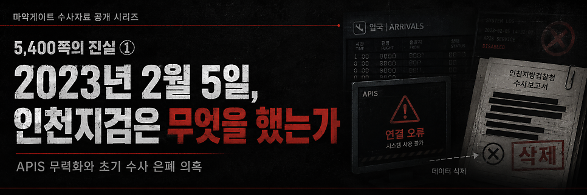

# [공지] 수사할 수 없는 수사관이 기록을 남깁니다.

> 출처: [https://m.blog.naver.com/backtcheck/224321794263](https://m.blog.naver.com/backtcheck/224321794263)  
> 작성일: 2026. 6. 20. 15:25

**마약게이트 기록 공개를 시작하며**
**"수사관을 수사 현장에서 내쫓을 수는 있지만, 수사과정에 남겨진 진실의 흔적까지 지울 수 없습니다."**

저는 이 사건을 폭로하고 싶었던 것이 아니라, 수사하고 싶었습니다.
한명의 형사로서, 마약과의 전쟁터로 꽃같은 동료들을 밀어 넣은 수사 책임자로서,
국민의 생명과 안전을 위협하는 대규모 마약 사건의 진실을 끝까지 수사하고 싶었습니다.
그러나 현재 대한민국을 뒤흔들었던 마약게이트는 '밀수범들의 진술 모의에 속아 넘어간 백 경정이 무리하게 수사를 진행한 사건으로, 실체가 없어 혐의 없다'고 결론을 내고 사건을 암장해버렸습니다. 마약게이트의 주범인 검찰이 스스로 셀프수사해서 '실체 없는 사건이다'라고 '대국민 사기극'을 연출한 것입니다.
제도권 안에서 지난 1,000일 동안 할 수 있는 모든 적법 절차를 거쳤습니다. 그리고 이제, 더 이상 수사하지 않겠다는 의사를 명확히 밝힙니다. 수사 책임자로서 제 역할과 에너지는 모두 소진되었습니다.
이제 저는 투사의 복장을 벗고, 그저 진실을 온전히 전달하는 자로서 마지막 소임을 다하고자 합니다. 정년을 앞둔 이 쇠락한 경찰공무원이 할 수 있는 마지막 일은, 헌법과 법률에 명시된 공직자의 의무를 다하며 이 기록을 역사의 법관과 국민 수사대의 안목에 맡기는 것뿐입니다.

그래서 이 블로그를 시작합니다.
이곳은 분노를 쏟아내기 위한 공간이 아닙니다. 누군가를 공격하기 위한 공간도 아닙니다.
제가 직접 겪은 일, 제가 확인한 자료, 그리고 수사로 밝혀져야 할 질문들을
국민 앞에 차례로 남기기 위한 기록의 공간입니다.

제가 문제를 제기해 온 이른바 '마약 게이트'는 결코 한 경찰 개인의 좌천이나 불이익에 그치는 지엽적인 문제가 아닙니다. 이 사건은,
1. 대한민국의 국경 관리 시스템이 왜 무력화되었는지,
2. 권력기관의 안보 책임과 수사 책임은 어디로 사라졌는지,
3. 국가의 시스템이 과연 누구를 위해 작동하고 있는지,
국가의 존재 이유, 국가기관의 본연의 임무에 관한 문제입니다.

많은 분들이 제게 묻습니다.
“도대체 무슨 일이 있었던 것입니까?”
“무엇이 확인된 사실이고, 무엇이 수사를 통해 밝혀져야 할 의혹입니까?”
“왜 이 사건은 제대로 수사되지 못했습니까?”
저는 앞으로 이 블로그를 통해 이 질문들에 하나씩 답하려 합니다.
다만 분명한 원칙을 세우겠습니다.
첫째, 확인된 사실과 저의 판단을 구분하겠습니다.
둘째, 제가 직접 겪은 일과 기록으로 확인 가능한 내용을 구분하겠습니다.
셋째, 수사로 밝혀져야 할 의혹은 의혹으로 표시하겠습니다.
넷째, 공익과 무관한 개인정보와 사생활은 다루지 않겠습니다.
다섯째, 국민께서 이해하실 수 있도록 가능한 한 쉽게 설명하겠습니다.

**"진실은 저절로 드러나지 않습니다."**

진실은 저절로 드러나지 않습니다.
진실은 끝까지 질문하고, 끝까지 지켜보는 평범한 시민들의 힘 속에서 비로소 모습을 드러냅니다.
국민 여러분께 간곡히 부탁드립니다. 이 기록을 함께 읽어 주십시오. 그리고 이 사건이 다시 제대로 된 법의 심판대 위에 오를 수 있도록 끝까지 눈을 떼지 말고 지켜봐 주십시오.
제도와 권력은 진실을 멈춰 세웠지만, 기록과 함께 제가 할 수 있는 마지막 소임을 다하겠습니다.

2026년 6월 19일 백해룡 경정 올림

다음 기록 예고

*https://blog.naver.com/backtcheck/224322082301*

> 🔗 [[5,400쪽의 진실 ①] 2023년 2월 5일, 인천지검은 무엇을 했는가?](https://blog.naver.com/backtcheck/224322082301)
> APIS 무력화와 초기 수사 은폐 의혹 저는 제가 마주했던 거대하고 참혹한 진실, 그리고 그 진실을 덮으...
