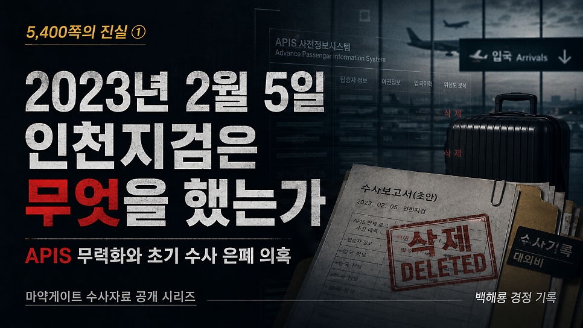
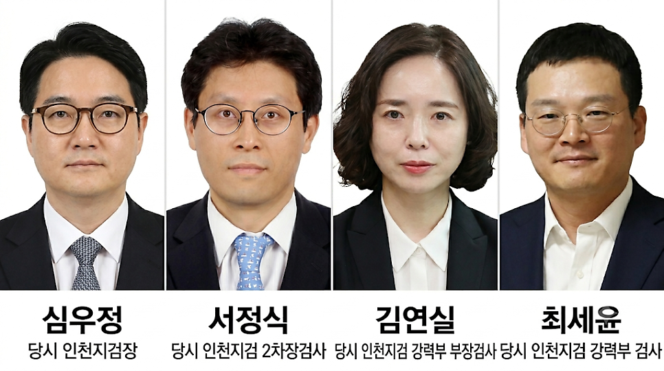
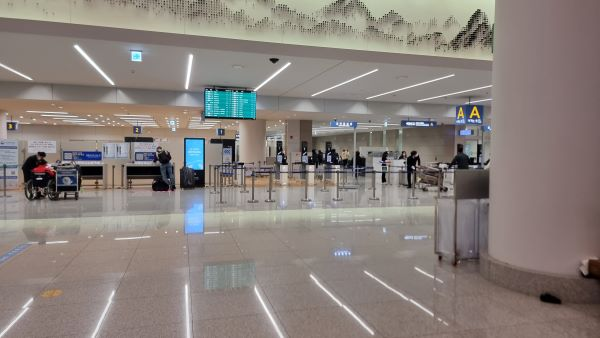
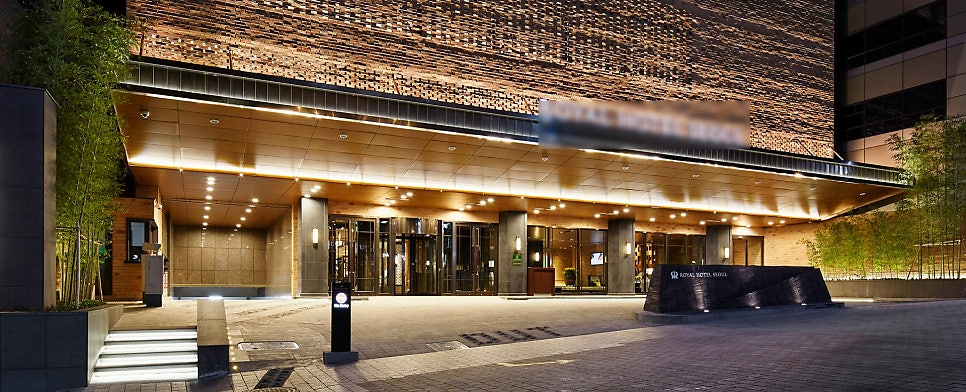
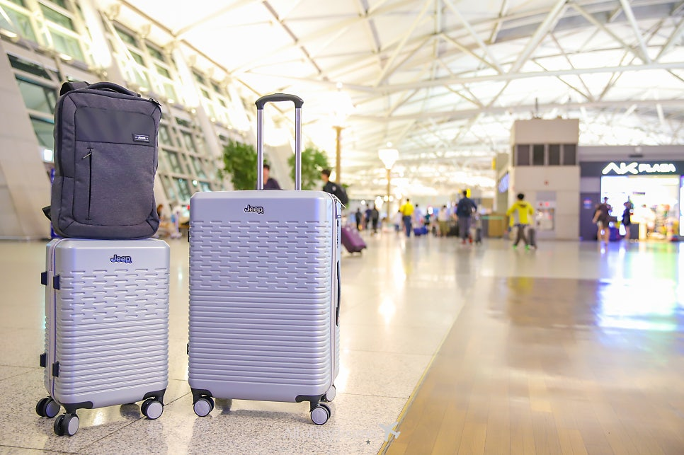
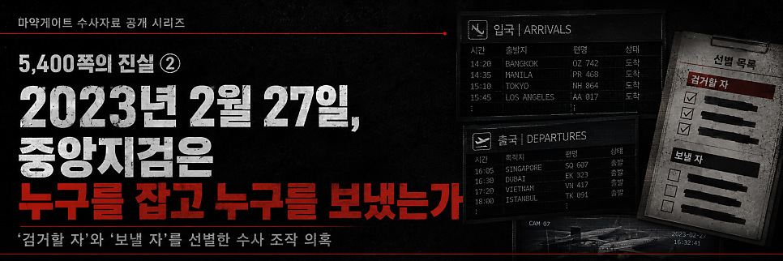

# [백해룡 경정 - 5,400쪽의 진실 ①] 2023년 2월 5일, 인천지검은 무엇을 했는가?

> 출처: [https://m.blog.naver.com/backtcheck/224322082301](https://m.blog.naver.com/backtcheck/224322082301)  
> 작성일: 2026. 6. 20. 23:22

**APIS 무력화와 초기 수사 은폐 의혹**

저는 제가 마주했던 거대하고 참혹한 진실,  
그리고 그 진실을 덮으려 작동했던 권력의 민낯을  
국민 여러분 앞에 가감 없이 공개하려 합니다.  
공개될 기록이 ‘역사의 파수꾼’이 되어,  
활자로도 영상으로도 아프게 남기를 희망합니다.  
대한민국의 안보와 사법 시스템을 붕괴시킨 마약게이트,  
그 첫 번째 이야기,

**‘2023년 2월 5일, 심우정·서정식·김연실·최세윤의 인천지검은 무엇을 했는가**’

**인천지검 2023형제7362호 -초기 수사 은폐 및 조직적 방조 실태**

---

**1. 무력화된 국가 안보시스템(APIS)과 세관 유착**

**의도적 시스템 조작**  
2023년 2월 5일, 마약 조직원들이 도착하기 전 APIS에 자동 등재된 우범자 그룹 정보가  
인위적으로 삭제되었습니다. 당시 신입이었던 김00 서기보의 수작업 재등록이 없었다면,  
밀수단 전원은 아무런 제재 없이 통과되었을 것입니다.  
**기막힌 근무 패턴의 일치**  
말레이시아 조직원들의 입국 시기인 2023년 1월 23일부터 2월 5일까지의 일정은  
인천공항세관 여행자통관 2국 1관의 근무일과 정확히 일치합니다.  
우웨이화가 검거된 날은 해당 근무조의 비번일이었습니다.  
이는 약속된 조력자가 부재한 상황에서 발생한 변수였다고 볼 수밖에 없는 지점입니다.  
**공범들의 ‘세이프 가드’**  
우웨이화 검거 직후, 공범인 얍이형, 웡카멍 등 6인은 다음 날 유유히 도주했습니다.  
동시에 침입 루트만 김해공항으로 바꾼 리고화, 쇼윈량 등이 바디패킹 상태로 입국했습니다.  
실무 권한자가 동일 예약 정보를 공유한 그룹 중 1인만 남기고 나머지를 삭제한 것은  
고의적 무력화의 증거입니다.

---

**2. 검찰의 선제적 현장 통제 및 기록 조작**  
**이례적인 직접 체포**  
통상적인 세관 인계 절차를 무시하고, 인천지검 최세윤 검사팀이 입국장 내부에서 대기하다 직접 체포를 집행했습니다.  
**검거경위 누락**  
김00 서기보가 아피스(APIS) 시스템에 수동 기재한 마약운반 의심자 등재 및 추적 검거 경위 관련 전산 자료는 수사개시의 당위성을 증명하는 가장 기초적인 자료임에도 누락되어 있습니다.  
**허위 공문서 작성**  
인천지검 김00 서기보가 작성한 보고서에는  
“피의자 우웨이화의 동승 승객은 없는 것으로 확인됨”이라는 명백한 허위 사실이 기재되었습니다.  
이미 시스템상 공범 존재를 알고도 수사 범위를 축소한 것입니다.  
**유령 문건의 존재**  
세관 직원이 작성한 적발 보고서에는 기안자 및 상급자 결재 흔적이 전무합니다.  
이는 책임 회피를 위한 비공식 문서로 수사를 가두려 한 정황입니다.

---

**3. 베이스캠프 수사 포기와 정보 은폐**  
**명동 R호텔 방치**  
마약 탈착 및 유통의 베이스캠프였던 명동 R호텔은  
조직원과 운반책들이 반드시 경유하는 핵심 장소였습니다.  
그러나 압수된 세관신고서에 명시되어 있었음에도 일체의 확인이 없었습니다.  
심지어 도주한 공범들의 세관신고서는 기록에서 누락되었습니다.  
**디지털 네트워크 추적 생략**  
위챗 단체방의 존재를 인지하고도 검찰은  
이 거대한 디지털 네트워크와 공범들에 대한 추적을 고의로 생략했습니다.

---

**4. 안보 기관 공조 단절 및 퇴로 보장**  
**기관 협조 거부**  
제2터미널 대테러상황실 책임자는 검찰과 세관으로부터 공범 추적 협조 요청을  
단 한 차례도 받은 바 없다고 진술했습니다.  
**영상 기록물 소멸**  
협조가 있었다면 확보되었을 공항 내·외부 CCTV 도주 경로 영상은  
기관의 방관 속에 인위적으로 소멸되었습니다.

---

**5. 반복되는 핵심 물증 인멸**  
**사라진 캐리어**  
이온스캐너 양성 반응이 나온 우웨이화의 캐리어가 수사 기록에서 사라졌습니다.  
이는 2023년 2월 27일 중앙지검의 우칭저 등 3명 검거 때에도 똑같이 반복된 행태입니다.  
3개의 캐리어 흔적이 없습니다.  
캐리어의 존재를 고의로 누락했다고 볼 수밖에 없는 지점입니다.  
최근 2025년 7월, 김포공항으로 입국하려던 마약 운반책의 휴대용 캐리어에서 24kg의 마약이 발견된 사례는 이 지점이 얼마나 중대한 위험 신호인지 보여줍니다.

---

**6. 고의적인 공범 입·출국 방조**  
**긴급 출국정지 미실시**  
특정된 공범들에 대해 최소한의 조치도 하지 않아 김해공항 등을 통한 출국을 허용했습니다.  
국가 감시망이 왜 그들에게만 작동하지 않았는지 반드시 밝혀져야 합니다.

---

**결론**  
2023년 2월 인천지검의 사건은 단순한 수사 과실이나 직무유기 사건이 아닙니다.  
**국가 안보 시스템과 수사 기록을 조직적으로 파괴한 ‘검찰게이트’입니다.**  
진실은 권력의 카르텔이 두려워 잠시 숨었습니다.  
저는 그 진실에게 “함께 용기를 내자”고 외치고 있습니다.  
국민 여러분,  
이 참담한 진실이 드러나지 않는다면,  
대한민국의 안보와 국민의 안전은 지켜내기 어렵습니다.  
함께해 주십시오!

2026년 5월 5일 백해룡 경정 올림.

---

*https://blog.naver.com/backtcheck/224322085647*

---

다음 기록 예고

> 🔗 [[5,400쪽의 진실 ②] 2023년 2월 27일, 중앙지검은 누구를 잡고 누구를 보냈는가?](https://blog.naver.com/backtcheck/224322085647)
> ‘검거할 자’와 ‘보낼 자’를 선별한 수사 조작 의혹 대한민국 안보와 사법 시스템을 붕괴시킨 마약게이...
