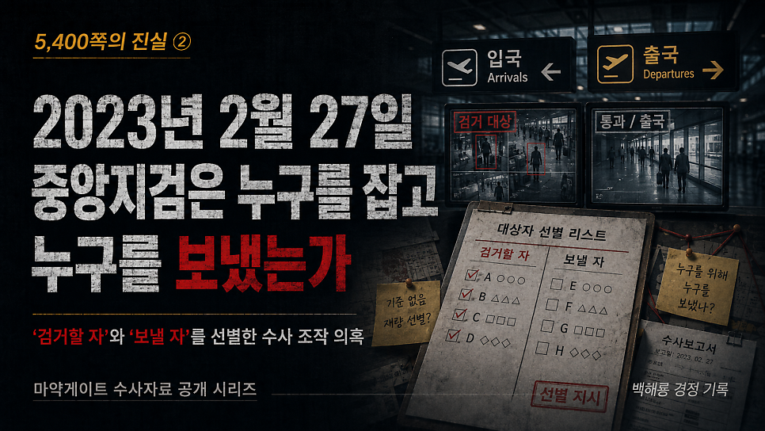
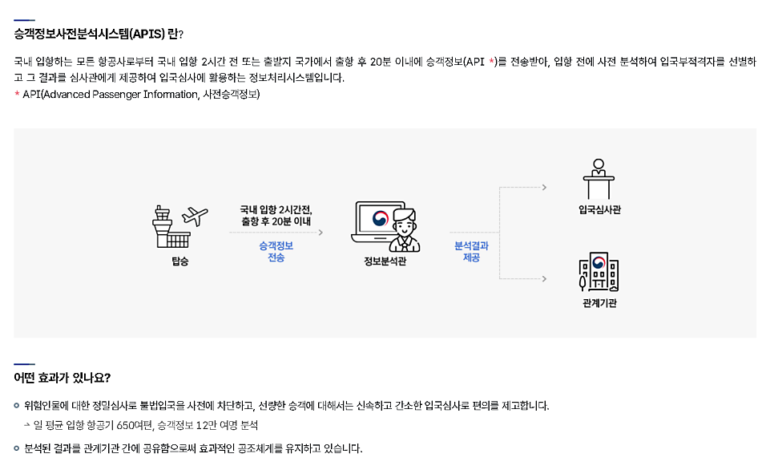
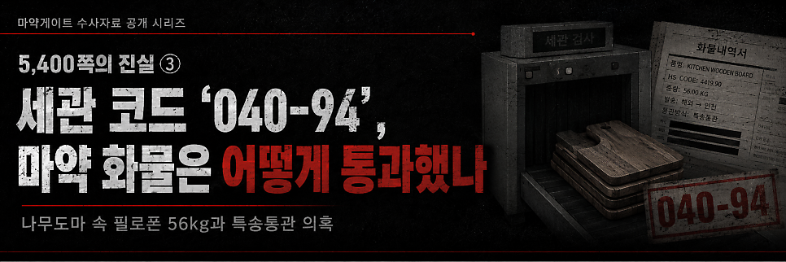

# [백해룡 경정 - 5,400쪽의 진실 ②]  2023년 2월 27일, 중앙지검은 누구를 잡고 누구를 보냈는가?

> 출처: [https://m.blog.naver.com/backtcheck/224322085647](https://m.blog.naver.com/backtcheck/224322085647)  
> 작성일: 2026. 6. 20. 23:27

**‘검거할 자’와 ‘보낼 자’를 선별한 수사 조작 의혹**

대한민국 안보와 사법 시스템을 붕괴시킨 마약게이트,
그 두 번째 이야기를 보고합니다.
이번 글에서는 **중앙지검 2023형제12530호 사건**의 수사 조작 의혹과
안보 시스템 사유화 실태를 국민 여러분 앞에 공개합니다.
이것은 단순한 직무유기가 아니라,
국가 안보 시스템을 특정 범죄 조직의 전용 통로로 제공한 ‘기획된 방조’라고 판단합니다.
이 진실이 활자와 영상으로 아프게 남아, 역사의 파수꾼이 되어주기를 희망합니다.

---

**1. 핵심 공범 4명에게 퇴로를 열어준 인위적 체포 지연**
**2023년 2월 27일 03:31경,**
우범자로 관리되던 우칭저 등 3명의 입국이 확인되었습니다.
**같은 날 09:00경,**
캐린스 등 4명의 출국 시도가 ‘알리미’ 시스템을 통해 모두 포착되었습니다.
당시 중앙지검과 인천공항세관 수사팀은 김해공항 현장에 대기 중이었습니다.
그럼에도 캐린스 일행이 탑승 후 이륙할 때까지 체포하거나 제지하지 않았습니다.
결과적으로 수사팀은 주범급 인물 4명이 유유히 출국한 뒤인
**14:25경에야 남은 3명을 체포**했습니다.
이는 공범들에게 완벽한 퇴로를 제공한 것입니다.

---

**2. 안보 시스템의 선택적 운용과 재입국 방치의 미스터리**
동일 항공편의 우범자 7명 모두 알리미가 작동했음에도,
입국자 3명만 검거하고 출국하려던 4명은 정상적으로 출국 심사를 통과했습니다.
또한 밀수 이력을 인지하고 있던 캐린스와 위나가
2023년 7월 5일 인천공항으로 재입국했을 때에도 아무런 조치가 이루어지지 않았습니다.
이들은 이후 나무도마 화물을 이용해 필로폰 56kg을 유통시켰습니다.
더욱이 이들이 입국한 바로 다음 날인 7월 6일,
중앙지검은 수사 중이던 사건을 즉시 종결 처리했습니다.
이는 “추적 감시를 위해 입국시켰다”는 검찰의 해명이 사실과 다르다는 점을 보여줍니다.

---

**3. 관할권 없는 중앙지검의 기획 수사와 ‘알리미’ 관리 의혹**
중앙지검은 관할권이 있는 부산지검이나 인천지검의 개입을 차단한 채,
인천공항세관을 호출하여 직접 김해공항 현장을 통제했습니다.
특히 관할권도 없는 중앙지검이 어떻게 인천공항세관과 ‘알리미’ 시스템을 통해
12명의 마약 우범자를 공동 관리했는지 그 경위를 반드시 밝혀야 합니다.
이는 타 기관의 라인을 차단하고 중앙지검이 직접 제한적 검거를 관리하려 했다는 의혹을 낳습니다.
그 경위는 기록에서 감춰져 있습니다.
이런 비상식적인 일을 누가 지시했는지 국민 앞에 밝혀져야 합니다.

---

**4. 비상식적 피의자신문조서, 증거는 회피하고 자백은 묵살**
김태호 검사는 2023년 2월 28일 피의자 3명을
동시에 조사했다는 비현실적 기록을 남겼습니다.
진술 녹화조차 존재하지 않습니다.
리고화는 “서울역 호텔에서 베트남인에게 마약을 넘겼다”고 자백했습니다.
압수한 우칭저 노트에는 명동 R호텔이 베이스캠프로 사용된 정황도 드러났습니다.
그러나 검찰은 중앙지검 근처에 있는 명동 베이스캠프 수사는 회피했습니다.
대신 사건 본질과 무관한 부산 호텔 화장실 수색 기록을 남기며 시선을 분산시켰습니다.
우칭저 노트에 적힌 마약 운반책은 20여 명에 이르고, 이들의 입·출국 내역도 확인되었습니다.
그럼에도 공항 입국장 CCTV 영상 확보는커녕 수사보고 한 줄 남기지 않았습니다.

---

**5. 알리미·APIS·CCTV 영상 자료와 캐리어의 조직적 인멸**
알리미를 통해 우칭저 등 3명의 입국 사실을 알게 된 즉시 세관과 협업해 APIS를 걸었다면, 출국을 시도하던 캐린스 등 4명의 알리미와 APIS 정보도 기록에 남아야 합니다.
그러나 알리미와 APIS 관련 근거는 단 하나도 남아 있지 않습니다.
추적·검거 과정의 CCTV 영상자료도 사라졌습니다.
이 자료들은 반드시 수사기록에 남아야 할 핵심 증거입니다.
검거된 3명의 휴대용 캐리어도 압수 목록에서 제외되었습니다.
캐리어를 수색했다는 수사보고 한 줄, 사진 한 장 없습니다.
도대체 그 캐리어 안에는 무엇이 들어 있었습니까.

---

**결론**

송경호, 고형곤, 신준호, 윤국권, 김태호의 중앙지검은
확보한 12명의 명단과 데이터를 바탕으로 ‘검거할 자’와 ‘보낼 자’를 사전에 분류했습니다.
이는 인천지검과 세관의 범죄를 덮기 위해 사건을 축소·은폐한 것이며,
국가 안보 시스템을 특정 범죄 조직의 전용 통로로 상납한 매국 범죄라고 판단합니다.
국민 여러분,
이 참담한 진실이 드러날 수 있도록 함께해 주십시오.

2026년 5월 6일 백해룡 경정 올림.

---

다음 기록 예고

*https://blog.naver.com/backtcheck/224322087871*

> 🔗 [[5,400쪽의 진실 ③] 인천공항 세관 코드 ‘040-94’, 마약 화물은 어떻게 통과했나?](https://blog.naver.com/backtcheck/224322087871)
> 나무도마 속 필로폰 56kg과 특송통관 시스템 교란 의혹 오늘은 마약게이트 그 세 번째 이야기를 보고드립니...
