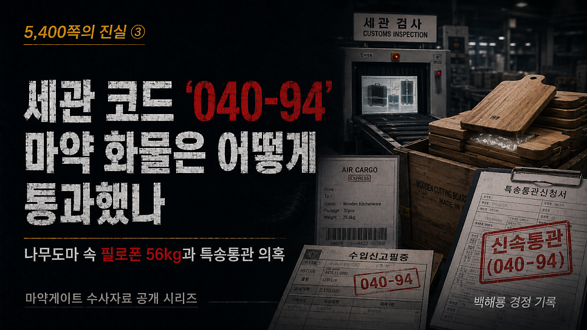
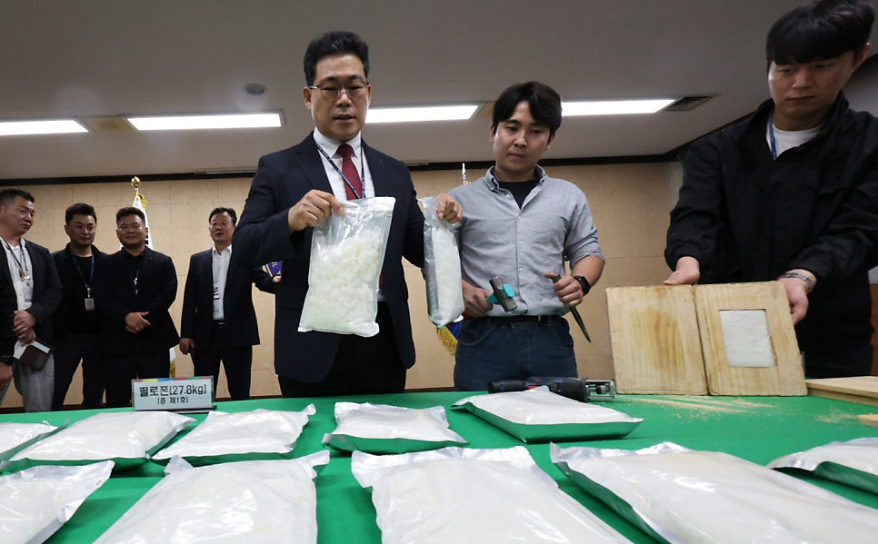
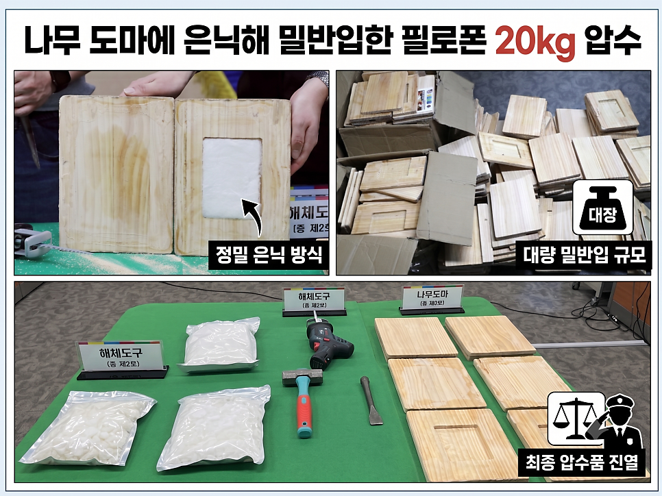
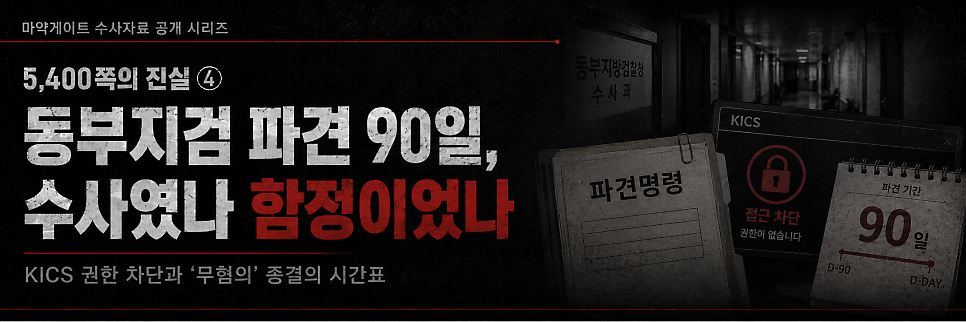

# [백해룡 경정 - 5,400쪽의 진실 ③] 인천공항 세관 코드 ‘040-94’, 마약 화물은 어떻게 통과했나?

> 출처: [https://m.blog.naver.com/backtcheck/224322087871](https://m.blog.naver.com/backtcheck/224322087871)  
> 작성일: 2026. 6. 20. 23:31

**나무도마 속 필로폰 56kg과 특송통관 시스템 교란 의혹**

오늘은 마약게이트 그 세 번째 이야기를 보고드립니다.  
이번 글은 마약 조직의 ‘하이패스’가 된  
인천공항세관 특송통관 코드 ‘040-94’의 실체에 관한 기록입니다.  
대한민국 국경의 최전선인 인천공항세관이 마약 조직의 전용 통로로 전락했습니다.  
말레이시아 마약 조직이 2023년 7월부터 9월 사이, 나무도마 내부에 필로폰을 숨겨  
대량 밀반입한 사건은 조직의 치밀함보다 세관 내부 조력자들의 조직적 방조와  
명백한 행정적 위법이 있었기에 가능했다고 판단합니다.

---

**1. 기록이 증명하는 마약 통과 타임라인**  
마약 조직에게 특송통관은 이미 안방처럼 열려 있었습니다.  
그들에게 숙제는 통관이 아니라 오히려 국내에서 화물을 안전하게 받아줄 사람을 찾는 것이었습니다.  
세관 시스템상 ‘수리’ 버튼이 눌린 순간, 국경은 무방비로 개방되었습니다.  
특정 부서(과), 즉 040-94가 반복 개입된 이 기록은 결코 우연이 아닙니다.  
**1차: 2023년 7월 19일**  
담당자: 박00 / 과: 040-94  
필로폰 16kg 은닉 화물 → 검사 없이 수리, 국내 유통 완료  
**2차: 2023년 8월 10일**  
담당자: 장00 / 과: 040-94  
필로폰 20kg 은닉 화물 → 3일 만에 수리, 국내 유통 완료  
**3차: 2023년 9월 7일**  
담당자: 소00 / 과: 040-94  
필로폰 20kg 은닉 화물 → 수리 직후 수사팀에 의해 현장 압수  
**4차 테스트: 2023년 9월 12일**  
담당자: 박00 / 과: 040-94  
식당용품 등 31.9kg → 포섭한 수취대행자 ABDUL을 안심시키기 위한 통관 연습용  
**'압둘'**이 물품 수령을 확인하는 순간,  
선적 대기 중이던**750kg 규모의 거대 화물**이 투입될 예정이었습니다.  
이 안에는 **필로폰 100kg**이 포함된 것으로 판단됩니다.

---

**2. 압둘을 방패막이로 세운 기만술과 마이클의 회수 작업**  
마약 총책 마이클은 이태원 식당 운영자 압둘을 포섭해 범죄의 전면에 세웠습니다.  
2023년 9월 12일, 압둘이 직접 관세까지 내게 하며 정상 무역으로 믿게 한 통관 연습은  
사실상 필로폰 100kg 밀반입을 위한 최종 점검이었습니다.  
매수된 세관 팀 040-94가 승인 버튼을 누르며 판을 깔아주었으나,  
수사망이 좁혀지며 국내 유통책이 검거되자 상황은 반전되었습니다.  
검거 사실을 눈치챈 마이클은 수사망을 피하고자  
쿠알라룸푸르 공항에 대기 중이던 마약 화물을 즉각 회수했습니다.  
그 결과 100kg의 추가 밀반입은 미수에 그쳤습니다.

---

**3. 정상적인 행정으로는 절대 불가능한 4대 위법 정황**  
수사 결과, 세관 시스템상 존재할 수 없는 인위적 조작 정황이 확인되었습니다.  
**첫째, X-Ray 검사 무력화**  
100% 검사 의무 품목임에도 대량의 마약이 적발되지 않았습니다.  
**둘째, 식약처 신고 의무 위반**  
필수 수입 요건이 공란이었음에도 통관이 승인되었습니다.  
**셋째, 목록통관(P/L) 오분류**  
100kg이 넘는 상업 화물이 개인용 간이 절차로 처리되었습니다.  
**넷째, 고의적 C/S 검사 생략**  
담당자가 시스템에서 직접 검사 생략을 조작해 실물 확인 없이 수리한 정황이 있습니다.

---

**4. 상식을 비웃는 경제적 비합리성에 침묵한 세관**  
개인이 고중량의 나무도마 수백 개를 물건값보다 비싼 항공운송료까지 지불하며 들여오는 구조는,  
수사의 기초만 아는 사람이라면 누구라도 감지할 수 있는 명백한 범죄 신호였습니다.  
그러나 국경의 파수꾼이라는 전문가들은 이 모든 신호를 철저히 무시했습니다.  
그들이 지켜야 했던 것은 국민의 안전이었습니까? 아니면 마약 조직의 이익이었습니까?  
그것도 아니라면, 도저히 거역할 수 없는 거대 권력의 편에 서고 싶었던 것입니까?  
이것은 무능이 아니라 공조이며, 실수가 아니라 명백한 범죄입니다.  
특정 부서 040-94를 거친 화물들이 반복적으로 마약 통로가 된 것은 결코 우연이 아닙니다.  
박00, 장00, 소00, 박00. 이들의 이름과  
그들이 클릭한 ‘수리’ 버튼은 대한민국 마약 오염의 결정적 증거입니다.

특정범죄가중처벌법 위반, 관세법 위반, 마약류관리법 위반죄가 모두 적용될 수 있습니다.  
국가를 위태롭게 하고 국민의 삶을 파괴한 이들의 유착 배후는 누구입니까?  
곧 공개될 5,400쪽의 수사기록이 권력 뒤에 숨은 진실을 낱낱이 증명할 것입니다.  
진실의 기록은 결코 굽어지지 않습니다.  
함께해 주십시오.

2026년 5월 7일 백해룡 경정 올림.

*박노해 시인의 글 인용*

---

다음 기록 예고

*https://blog.naver.com/backtcheck/224322107535*

> 🔗 [[5,400쪽의 진실 ④] 동부지검 파견 90일, 수사였나 함정이었나?](https://blog.naver.com/backtcheck/224322107535)
> KICS 권한 차단과 ‘무혐의’ 종결의 시간표 오늘은 마약게이트 네 번째 이야기, 대한민국 사법 역사에...
