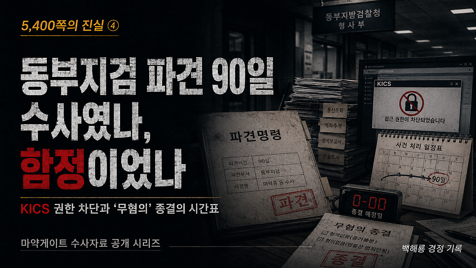
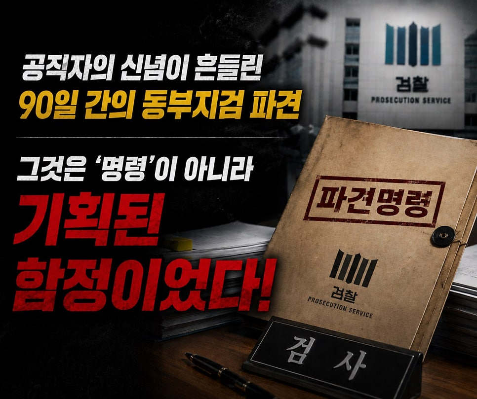
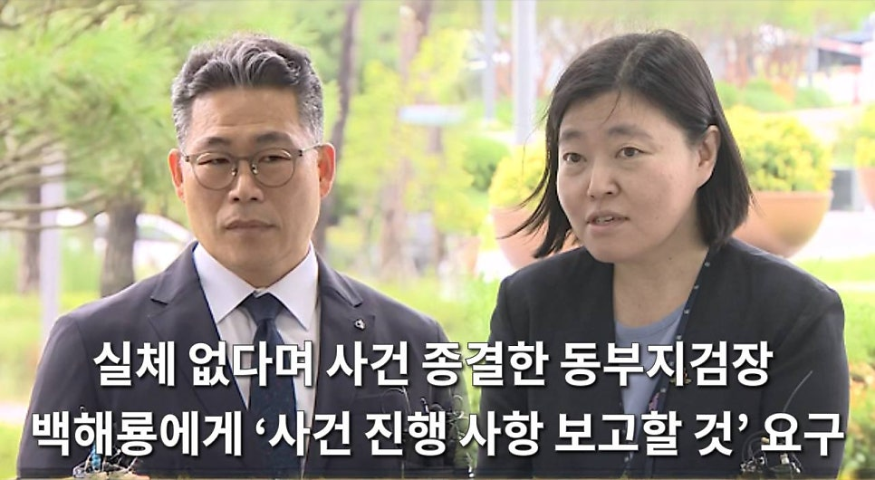
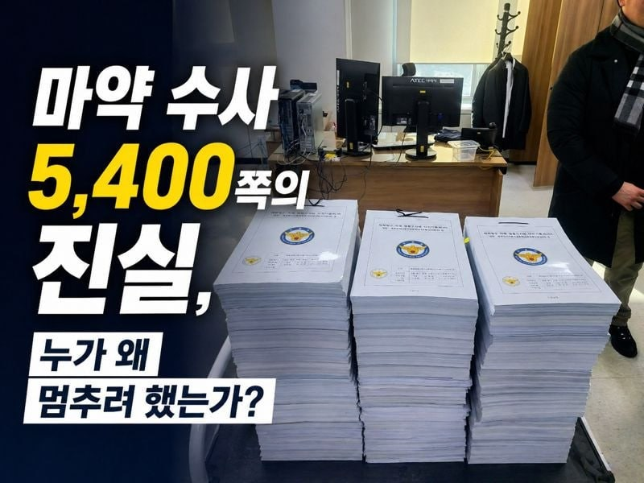
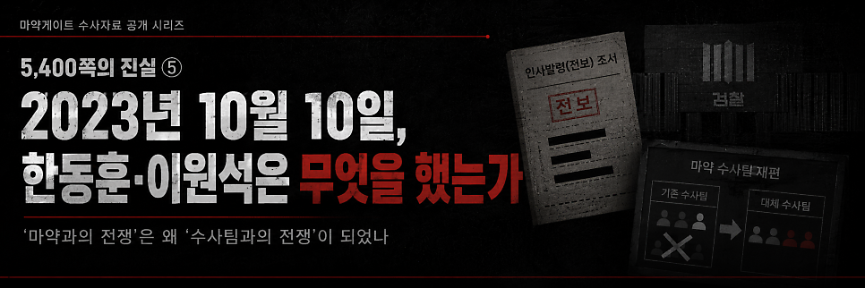

# [백해룡 경정 - 5,400쪽의 진실 ④] 동부지검 파견 90일, 수사였나 함정이었나?

> 출처: [https://m.blog.naver.com/backtcheck/224322107535](https://m.blog.naver.com/backtcheck/224322107535)  
> 작성일: 2026. 6. 21. 0:00

**KICS 권한 차단과 ‘무혐의’ 종결의 시간표**

오늘은 마약게이트 네 번째 이야기,  
대한민국 사법 역사에 치욕으로 기록될 동부지검 파견의 사법 농단 실체에 대해 보고합니다.  
이것은 정당한 수사도, 행정도 아니었습니다.  
저와 마약게이트의 진실이 담긴 5,400쪽의 수사기록을 통째로 매장하기 위해 설계된  
사법적 함정이자 기획된 음모였습니다.

**기획된 음모**  
**“KICS 권한을 어제 줬는데, 오늘 수사를 종결합니까?”**

---

**1. 파견은 수사가 아닌 고립이었습니다**  
2025년 10월 12일, 저에 대한 파견 명령이 언급된 직후  
합수단 내부 관계자로부터 충격적인 경고가 전해졌습니다.  
“이미 무혐의 결론은 나 있다. 파견은 백해룡을 매장하기 위한 절차이니 오면 안 된다.”  
이 위험 신호는 곳곳에서 징후를 동반하며 제게 도달했습니다.  
그러나 저는 명령에 따라야 하는 공직자였습니다.  
인적·물적 지원에 대한 협의조차 없는 1인 강제 파견.  
공직자로서 명령에 순응하며 첫 출근을 하던 날,  
저는 “공직자로서 처음 신념이 흔들린다”는 참담한 고백을 할 수밖에 없었습니다.

---

**2. KICS 권한 거부를 통한 수사 불능화**  
검찰과 경찰은 파견 종료 직전인 2025년 11월 13일까지 형사사법정보시스템, 즉 KICS 접속을 승인하지 않았습니다.  
KICS는 수사관이 사건을 접수하고 수사에 착수할 수 있는 유일한 법적 시스템입니다.  
접속 권한을 막은 것은 단순히 정보를 가린 것이 아닙니다.  
수사 착수 자체를 원천 봉쇄하여 수사팀을 유령으로 만든 행정적 폭거였습니다.

---

**3. 답안지는 이미 작성되어 있었습니다**  
백해룡 수사팀이 시스템 권한이 없어 수사 착수조차 못 하던 시점,  
동부지검장과 합수단은 돌연 “수사 결과를 발표하겠다”고 공표했습니다.  
수사 과정 없이 결과부터 내놓겠다는 기만적 행태였습니다.  
이는 이미 ‘무혐의’라는 답안지를 써놓고 발표 시점만 저울질하고 있었음을 자인하는  
기획된 음모의 고백이었습니다.

---

**4. 언론이 증명한 진실: 수사가 아닌 종결이 목적**  
당시 언론들은 합수단의 비정상적인 행태를 날카롭게 고발했습니다.  
오마이뉴스는 “피의자 소환 없이 중간발표를 강행하려다 내부 반발에 직면했다”고 보도했습니다.  
한겨레는 “무혐의 보도자료를 미리 작성했고, 정치적 종결 목적이 있었다”고 지적했습니다.  
경향신문은 “KICS 권한을 어제 줬는데 오늘 종결하느냐”는 수사팀의 항의를 보도했습니다.  
이 보도들은 합수단의 목적이 수사가 아니라 종결에 있었음을 보여줍니다.

---

**5. 법치의 사망: 법률을 유린한 사법적 폭거(25.12.09.)**

이재명 정부하에 출범한 합수단이다.  
이재명 정부의 검찰은 다르다.  
과연 그럴까요?

마침내 기록 분석을 마친 수사팀이 관세청 및 검찰청을 대상으로 압수수색 영장을 신청하기 직전,  
합수단은 전격적으로 ‘무혐의 종결’을 발표했습니다.  
실체적 진실로 향하는 마지막 관문을 물리적으로 폐쇄한 것입니다.  
저는 다음과 같이 고발합니다.  
**검찰청법 제8조 위반 의혹**  
구체적 사건에 개입할 수 없는 법무부 장관이 직접 ‘적의 처리’를 승인하며  
수사지휘권을 남용했습니다.  
**공수처법 제2조·제25조 위반 의혹**  
고위공직자의 직권남용은 공수처의 수사 대상임에도,  
검찰은 이를 부당하게 가져가 사법적 면죄부를 발행했습니다.  
**검찰청법 제4조 위반 의혹**  
동부지검장과 합수단은 관할 없는 사건에 개입하여 검찰 본연의 중립성과 독립성을  
스스로 무너뜨렸습니다.

---

**결론**  
국민 여러분,  
마약게이트의 핵심은 **국가 안보와 사법 시스템의 붕괴**입니다.  
정상적인 국가 작용을 교란시킨 자들이 여전히 카르텔을 형성하며 시스템을 장악하고 있습니다.  
진실과 정의를 쫓았던 팀원들은 여전히 감찰의 압박에 시달리고 있습니다.  
저를 따랐던 팀원들에게 또 죄를 짓고 말았습니다.  
저도 이제 많이 지쳤습니다.  
더 이상 “수사하게 해달라”고 구걸하지 않겠습니다.  
그저 공직자의 마지막 소임으로,  
이 참담한 사건의 실체를 하나하나 정리하여 역사의 기록 속에 남기려 합니다.  
부디 이 진실의 기록에 함께해 주십시오.

2026년 5월 8일 백해룡 경정 올림.

---

다음 기록 예고

*https://blog.naver.com/backtcheck/224322122287*

> 🔗 [[5,400쪽의 진실 ⑤] 2023년 10월 10일, 한동훈·이원석은 무엇을 했는가?](https://blog.naver.com/backtcheck/224322122287)
> ‘마약과의 전쟁’은 어떻게 ‘수사팀과의 전쟁’이 되었나 오늘은 마약게이트 수사 보고서, 그 다섯 번째 ...
