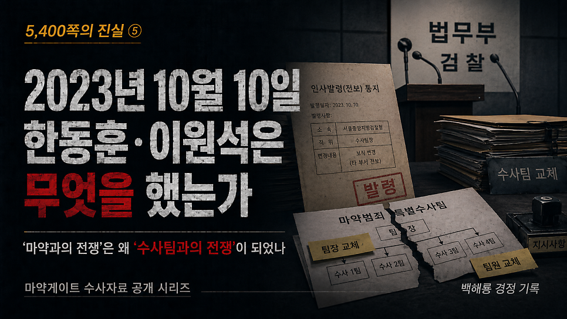
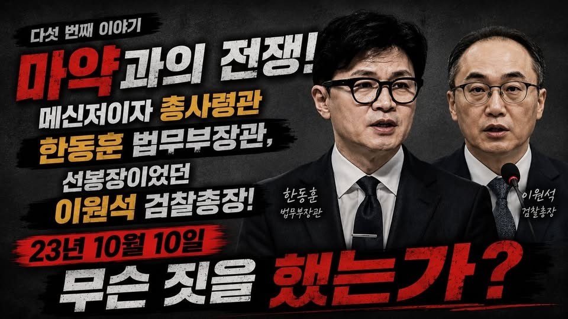
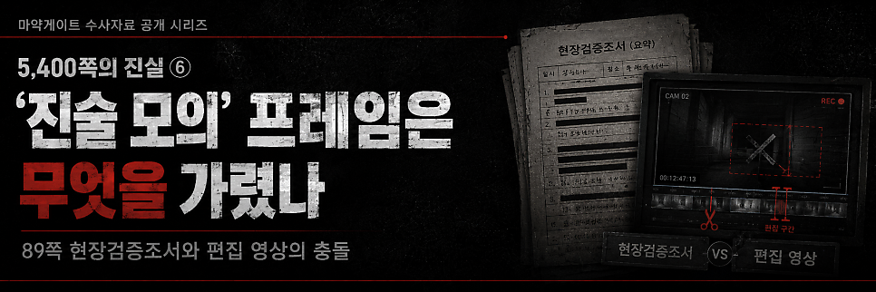

# [백해룡 경정 - 5,400쪽의 진실 ⑤] 2023년 10월 10일, 한동훈·이원석은 무엇을 했는가?

> 출처: [https://m.blog.naver.com/backtcheck/224322122287](https://m.blog.naver.com/backtcheck/224322122287)  
> 작성일: 2026. 6. 21. 0:22

**‘마약과의 전쟁’은 어떻게 ‘수사팀과의 전쟁’이 되었나**

오늘은 마약게이트 수사 보고서, 그 다섯 번째 이야기입니다.
대한민국 사법 정의의 최고 책임자였던 한동훈 당시 법무부 장관과 이원석 당시 검찰총장이 국가적 마약 참사를 어떻게 유린하고 진실을 덮으려 했는지, 그 구체적인 실상을 보고드립니다.

---

**1. ‘마약과의 전쟁’이라는 기만적 지침**
2022년 10월, 대통령은 ‘마약과의 전쟁’을 선포했습니다.
한동훈 법무부 장관과 이원석 검찰총장은 전국 검찰망에 무관용 원칙을 하달했습니다.
지휘부의 서슬 퍼런 구호 아래, 영등포서 전담팀은 목숨을 걸고 뛰었습니다.
그 결과 조직원 26명을 검거하고 필로폰 27.8kg을 압수하는 실질적인 성과를 거두었습니다.
그러나 우리 수사팀이 “인천공항세관 직원들이 밀수를 조력했다”는 결정적 증거를 확보하고, 이를 2023년 9월 11일 지휘부에 공식 보고한 순간부터 상황은 돌변했습니다.
‘마약과의 전쟁’은 진실을 은폐하기 위한 ‘수사팀과의 전쟁’으로 바뀌었습니다.

---

**2. 한동훈의 인사권 남용: 협력하던 검찰 수사팀을 해체한 원포인트 인사**
사건 초기 서울남부지검 형사6부는 매우 적극적이었습니다.
부장 이준동, 검사 조혁·김지훈이 있던 형사6부는 세관 연루 혐의가 포착된 후 우리 팀이 신청한 40회 이상의 영장을 즉시 검토·청구하며 법 절차를 지원했습니다.
심지어 9월 22일부터 사흘간 이미 구속 송치된 외국인 조직원까지 이례적으로 출정시켜 인천공항 현장검증을 감행하는 긴밀한 공조를 보여주었습니다.
그러나 세관 연루 의혹이 언론에 보도된 2023년 10월 10일, 믿기 힘든 일이 벌어졌습니다.
9월 11일 정기 인사가 단행된 지 불과 한 달 만에, 법무부 검찰국을 지휘하는 한동훈 장관은 형사6부 인원을 축소했습니다.
7명 체제였던 부서는 5명 체제로 줄었고, 부장과 차장이 전격 교체되었습니다.
해체 수준의 원포인트 인사였습니다.
그것도 모자라 ‘마약 사무’ 권한까지 빼앗아 형사3부로 강제 이전시켰습니다.
이는 수사 방해를 목적으로 인사권을 남용한 전형적인 직권남용이자 사법 폭력이었습니다.

---

**3. 현장 검사들의 절규: “대검에서 엄청 깨졌다”**
2023년 10월 10일 당일 늦은 오후,
남부지검 형사6부 조혁·김지훈 검사는 저희 수사팀에 전화해 외압의 고충을 토로했습니다.
대검 마약조직부가 ‘상부 보고 누락’을 빌미로 형사6부를 맹렬히 뒤흔들었기 때문입니다.
“대검에서 엄청 깨졌다. 우리가 모르는 내용이 있는가?
모두 보고해왔는데 대검에서 보고를 누락했다고 한다.”
이들의 호소는 수사 의지를 꺾으려는 수뇌부의 압박이 얼마나 집요했는지를 보여주는
생생한 증거입니다. 한동훈 장관의 인사권과 이원석 총장의 지휘권이 합작하여,
진실을 쫓던 검사들의 입을 막아버린 것입니다.

---

**4. 은폐의 목적: 과거 검찰의 수사 실패를 덮으려는 조직적 기획**
인천공항세관을 수사한다는 것은 단순히 마약 밀수를 밝히는 것 이상의 의미를 갖습니다.
세관을 들여다보는 것은 곧,
과거 인천지검 2023형제7362호 사건과 중앙지검 2023형제12530호 사건에서 자행된
두 차례의 수사 은폐 정황을 확인하는 일이기 때문입니다.
따라서 형사6부를 축소하고 마약 사무를 강제 이전한 조치는,
애초에 세관으로 향하는 그 어떤 수사나 증거 수집도 불허하겠다는
강력한 은폐 의지였다고 판단합니다.

---

**5. 절차로 포장된 위법성, 역사의 법정에 세우겠습니다**
조직 안정을 명분으로 특정 사건의 수사 라인을 해체한 행위는 직무 권한을 남용하여
사법 정의 실현을 방해한 명백한 범죄입니다.
그들은 위법성을 가리기 위해 형식적인 행정 절차를 거쳤을 것입니다.
그러나 그 실질은 정권과 검찰의 치부를 가리기 위한 조직적 기획입니다.
당시 인사 명령의 효력을 위해 대통령 서명이나 법무부 장관의 서면 결재가 실제로 존재했는지
엄격히 검증되어야 합니다.

---

**6. 정치적 알리바이로 보이는 한동훈의 메시지 타임라인**
**2023년 1월 26일: 선전포고와 전혀 다른 실상**
장관은 청와대 업무보고에서 마약 근절을 선포했습니다.
그러나 불과 하루도 지나지 않은 1월 27일 아침,
말레이시아 조직원 6명이 세관을 거쳐 대규모 필로폰을 밀반입했습니다.
**2023년 2월 6일: 전국 검사장 상대 엄벌 지시**
인천공항 시스템 붕괴와 수사 참사 직후,
장관은 전국 검사장들을 상대로 법정 최고형 구형을 지시했습니다.
그러나 그것은 사후 책임을 피하기 위한 정치적 알리바이에 불과했습니다.
말뿐이었기 때문입니다.
**2023년 4월 7일: 충언인가, 기만인가**
중앙지검에서 사건을 취급해 3월 16일 기소하고 내부 정리를 마친 뒤,
장관은 부산고검에서 “마약 수사는 특정 국가나 특정 계층을 타깃으로 하는 것이 아니다”라고
말했습니다. 너무나 당연한 이야기를 왜 그 시점에 했습니까.
미래세대의 안전을 명분으로 마약과의 전쟁을 선포한 뒤,
정작 공항의 문을 열어 말레이시아발 대규모 마약 수입을 원조한 배후 권력에 대한 충언이었습니까?
아니면 국민을 향한 기만이었습니까?
정말 발언의 저의가 없는 게 맞습니까?

---

**결론**
국민 여러분.
무너진 사법 시스템을 바로 세워 주십시오.
권력은 진실을 잠시 가릴 수 있어도, 영원히 묻을 수는 없습니다.
한동훈과 이원석이 주도한 이 참담한 은폐의 기록을 역사와 국민의 법정에 제출합니다.
부디 함께해 주십시오.
기록은 결코 굽지 않습니다.

2026년 5월 11일 백해룡 경정 올림.

---

다음 기록 예고

*https://blog.naver.com/backtcheck/224322131490*

> 🔗 [[5,400쪽의 진실 ⑥] ‘진술 모의’ 프레임은 무엇을 가렸나?](https://blog.naver.com/backtcheck/224322131490)
> 89쪽 현장검증조서가 반박하는 대국민 발표의 허구 마약게이트 여섯 번째 이야기를 보고드립니다. 서울동부...
