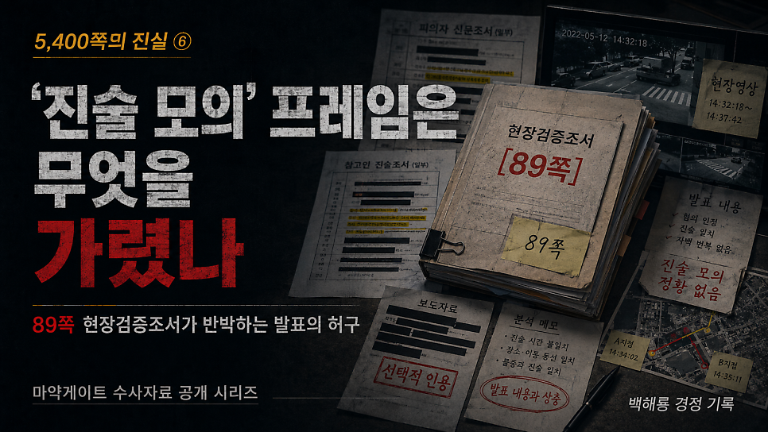
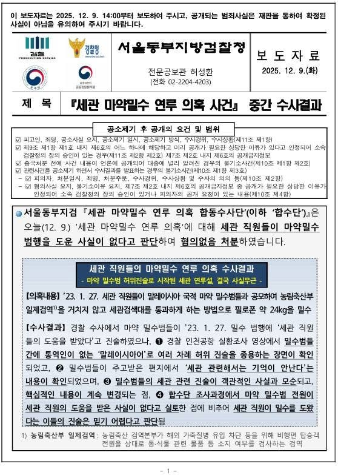
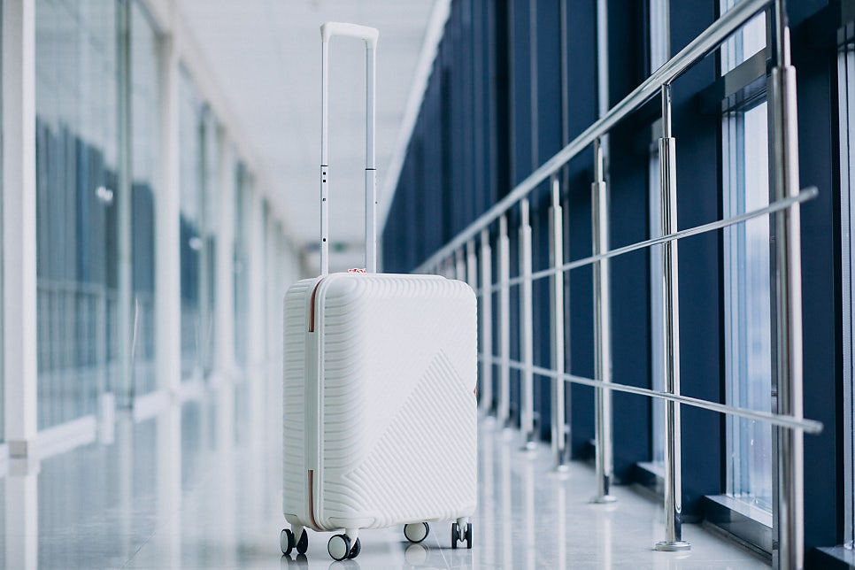
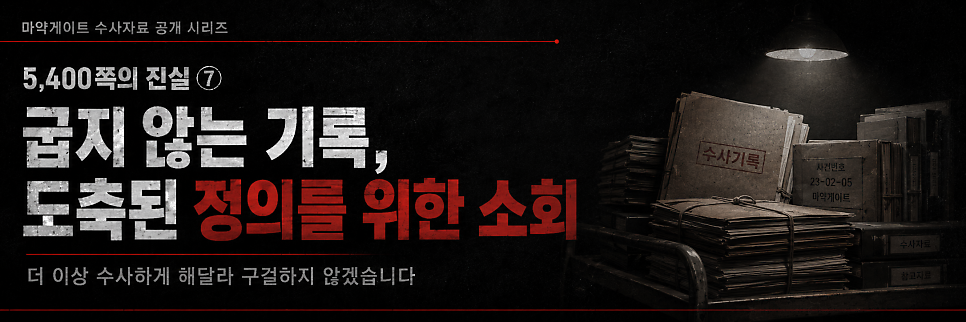

# [백해룡 경정 - 5,400쪽의 진실 ⑥] ‘진술 모의’ 프레임은 무엇을 가렸나?

> 출처: [https://m.blog.naver.com/backtcheck/224322131490](https://m.blog.naver.com/backtcheck/224322131490)  
> 작성일: 2026. 6. 21. 0:39

**89쪽 현장검증조서가 반박하는 대국민 발표의 허구**

마약게이트 여섯 번째 이야기를 보고드립니다.
서울동부지검 마약합수단은 이른바 마약게이트 ‘무혐의’의 유일한 버팀목으로 밀수범들의 ‘진술 모의’를 내세웠습니다.
30여 명이 넘는 대규모 합수단이 7개월간 국가 예산을 쏟아부으며 매달린 결과물이, 고작 현장 수사팀이 법원 영장을 발부받아 피땀으로 작성한 현장검증조서의 신빙성을 깎아내리는 것뿐이었습니까.
참으로 유치하고도 비겁한 수사 거부입니다.
검찰은 2023년 9월 22일의 편집된 영상을 내밀며 ‘진술 모의’를 선동하고 있습니다.
그러나 영장을 집행해 작성한 89쪽의 현장검증조서는 그 영상이 얼마나 악의적인 조작이자 허구인지를 신랄하게 꾸짖고 있습니다.
'진술 모의'라는 대국민 사기극! 국민을 속인 대가는 가혹할 것입니다.

---

**1. 9월 22일의 ‘종용’과 11월 10일의 ‘실패’**
검찰은 2023년 9월 22일 경찰의 실황조사 중 캐린스가 위나에게 말레이시아어로 허위 진술을
종용했으므로 이후 모든 진술이 오염되었다고 주장합니다.
하지만 수사의 기본을 아는 사람이라면 ‘종용 시도’와 ‘결과 성립’을 혼동하지 않습니다.
**악의적으로 편집된 ‘진술 모의’의 실체는 밀수범 간 다툼이었습니다**
합수단이 제시한 영상은 앞뒤 맥락을 자른 짜깁기입니다.
당시 캐린스와 위나는 각자 빠져나간 통로가 달라 다투기 시작했습니다.
짜증이 난 캐린스가 “네가 독자적으로 진술하면 경찰이 안 믿고 복잡해지기만 한다.
우리가 나간 루트로 갔다고 하고 빨리 끝내자”는 취지로 윽박지르듯 말한 상황이었습니다.
그럼에도 이를 교묘하게 짜깁기해 ‘진술 모의’로 둔갑시켰습니다.
수사팀이 말레이시아어라서 못 알아들었을까요.
손짓과 발짓을 섞어 나누는 격렬한 대화는 설령 외계어라 해도 그 의도가 전달됩니다.
**경험하지 않은 행동은 재현할 수 없습니다**
위나는 캐린스가 요구하는 거짓 동작을 재연할 수 없었습니다.
검찰 주장대로 모의가 성립되었다면, 50일 뒤인 11월 10일 현장검증에서 위나는 캐린스가 시킨 대로
행동했어야 합니다.
그러나 89쪽 현장검증조서의 진실은 정반대입니다.
**위나의 독자적 진술과 리고화의 증언**
위나는 “나는 피를 흘려 뒤처졌고,
4·5번 검사대가 아닌 승객들이 줄을 서 있는 그린라인을 따라 걷다가
세관직원의 안내를 받고 마샬구역으로 빠져나갔다”고 자기만의 경험을 재현했습니다.
반면 실제 4·5번 검사대 통로를 지나온 캐린스와 리고화의 진술은 일치합니다.
특히 검찰 스스로 신빙성을 인정했던 리고화는 캐린스보다 더 정확하게 범죄에 가담한 세관원들을
지목했습니다. 검찰은 ‘진술 모의’라는 거짓 각본을 들이밀었습니다.
그러나 현장의 기록은 단 한 문장도 그 대본을 따르지 않았습니다.
‘실패한 모의’의 흔적은 오히려 밀수범들의 현장 재현에 임의성과 신빙성을 더해주었을 뿐입니다.

---

**2. 물리적 행위의 재현은 몸이 기억하는 진실입니다**
입은 맞출 수 있어도, 무의식적인 물리적 행위는 속일 수 없습니다.
상호 격리된 피의자들이 특정 기둥 아래에서의 접선 신호, 줄펜스를 조작해 통로를 열어준 세관원의 구체적인 동작을 한 치의 오차 없이 재현했습니다.
특히 피의자들이 근무하지 않는 날에도 조력자들을 정확히 특정해낸 사실은, 단순한 말 맞추기로는 절대 불가능한 실체적 인지의 영역입니다.

---

**3. ‘진술 모의’로 전산에 남겨진 176kg의 필로폰 흔적도 지울 수 있습니까?**
검찰에 묻습니다.
당신들이 부정하고 싶은 세관 유착의 실체가 고작 밀수범들의 입에서만 나온 것입니까?
밀수범들이 설령 입을 맞추었다고 하더라도, 국가 전산망에 박제된 범죄의 로그는 매수할 수 없습니다.
30명이 넘는 밀수범이 바디패킹으로 통과시킨 120kg 이상의 필로폰.
나무도마 속 56kg 마약 유통 기록.
담당자가 직접 조작한 C/S 검사 생략의 흔적.
이것들은 지금도 국가 전산 시스템상에 살아 있습니다.
‘진술 모의’라는 거짓 프레임으로 디지털 증거의 진실을 덮을 수 있습니까?
디지털 증거는 지워지지 않는 범죄의 지문입니다.
0과 1로 기록된 객관적 물증 앞에 ‘진술 모의’라는 허구의 방패가 무슨 의미가 있습니까?

---

**4. 무엇이 두려워 캐리어까지 지웠습니까?**
합수단은 진술의 신빙성을 흔드는 데 골몰했을 뿐, 핵심 물증들은 모두 지워버리거나 감추었습니다.
마약 조직의 노트에 적힌 20여 명의 공범 수사는 왜 거부했습니까?
APIS 정보와 CCTV 영상은 왜 삭제되었습니까?
검거된 피의자들의 휴대용 캐리어는 왜 압수 목록에서 통째로 제외되었습니까?
증거는 스스로 사라지지 않습니다.
기록은 스스로 삭제되지 않습니다.
5,400쪽의 진실은 누가 진정한 범죄자이고,
누가 그들의 방패였는지를 낱낱이 고발하고 있습니다.

---

**5. 결코 굽지 않은 기록과 함께해 주십시오**
세관 시스템 조작 정황과 기록상 넘쳐나는 객관적 증거를 모두 묵살한 채, 오직 ‘진술 모의’라는 프레임으로 실체가 없다고 결론 내린 참담한 거짓 종결.
그 대국민 발표를 법무부 장관이 ‘적의 처리’하라며 승인했습니다.
곧 5,400쪽의 진실이 역사와 국민의 법정에 제출됩니다.
공개될 기록 이면에 숨겨져 있는 더 많은 흔적도 국민 여러분이 곧 살펴보게 될 것입니다.
조작된 ‘무혐의’라는 선동으로 현장의 비명 같은 증거와 진실을 가릴 수 없습니다.
실체적 진실은 활자가 되고 영상이 되어 영원히 남을 것입니다.
기록은 결코 굽지 않습니다.
부디 함께해 주십시오.

2026년 5월 12일 백해룡 경정 올림.

---

다음 기록 예고

*https://blog.naver.com/backtcheck/224322135060*

> 🔗 [[5,400쪽의 진실 ⑦] 굽지 않는 기록, 도축된 정의를 위한 소회](https://blog.naver.com/backtcheck/224322135060)
> “이제 공직자로서 마지막 소임을 다하려 합니다” 국민 여러분, 백해룡 경정입니다. 마약게이트 일곱 번째...
