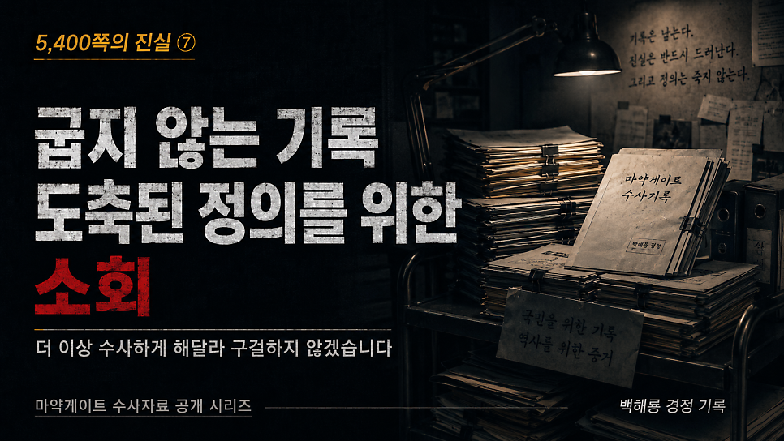
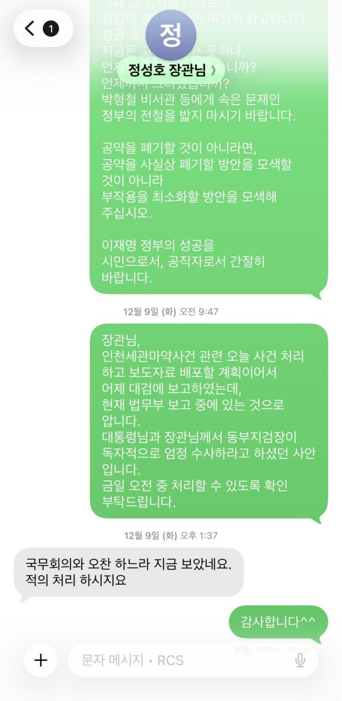
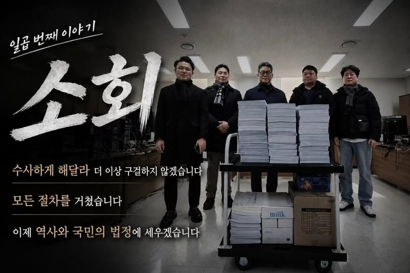
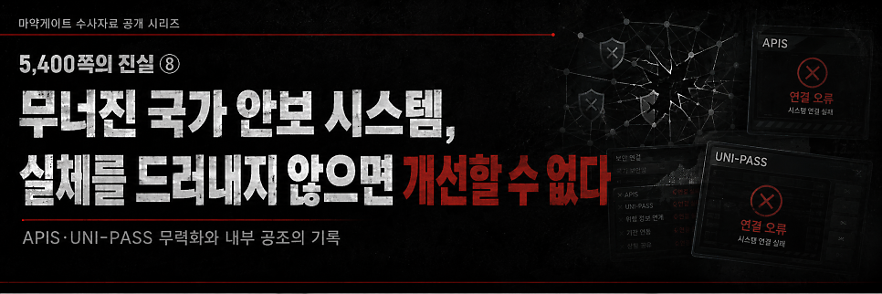

# [백해룡 경정 - 5,400쪽의 진실 ⑦] 굽지 않는 기록, 도축된 정의를 위한 소회

> 출처: [https://m.blog.naver.com/backtcheck/224322135060](https://m.blog.naver.com/backtcheck/224322135060)  
> 작성일: 2026. 6. 21. 0:46

**“이제 공직자로서 마지막 소임을 다하려 합니다”**

국민 여러분, 백해룡 경정입니다.
마약게이트 일곱 번째 이야기를 보고드립니다.
열 번째 이야기까지 보고드리고 나면,
5,400쪽의 수사기록은 국민과 역사의 법정에 온전히 제출될 것입니다.
저는 더 이상 수사하게 해달라고 구걸하지 않겠습니다.
국가기관이 ‘실체가 없다’고 선언하며 마침표를 찍었기에,
이 기록은 이제 수사 기밀이 아닌 역사의 기록물이 되었습니다.
권력이 지우려 했던 진실이 무엇인지, 국가 안보가 무너진 국경에서 어떤 일이 벌어졌는지,
이제 국민과 역사가 직접 판단해 주십시오.

---

**1. 사법 정의의 가면을 쓴 셀프 면죄부**
이미 확정된 인천·중앙·영등포의 판결들은 마약 밀수라는 현상을 단죄한 듯 보입니다.
하지만 그것은 본질을 가린 기만입니다.
마약 차단의 최첨병인 세관이 밀수 조직의 길을 열어주었고,
이를 인지한 검찰이 조직적으로 은폐하며 가담한 국가 시스템 붕괴의 본질은 철저히 감춰졌습니다.

---

**2. 23분 만에 도축된 정의와 관할권 침탈**
상설특검은 출범조차 하지 못한 채, 2025년 6월 검찰 주도의 합수단이 꾸려졌습니다.
외압을 방조했던 자들이 셀프 수사로 정의를 세우겠다고 나선 것입니다.
저는 제가 불법 단체라고 규정한 그 합수단에 파견되어,
국가가 어떻게 조직적으로 진실을 도려내는지 목격하는 고통의 시간을 보냈습니다.
저와 팀원들의 파견은 ‘혐의 없음’이라는 결론을 정해놓은 기획 수사의 정당성을 확보하기 위한
도구일 뿐이었습니다. 검·경 지휘부는 KICS 접속 차단, 통신 수사 결재선 차단 등
초법적 수단을 동원해 수사팀의 손발을 묶었습니다.
25년 12월 9일, 법무부 장관과 동부지검장이 사적 문자를 주고받으며 수사 종결을 승인한 직후,
단 23분 만에 기습적으로 발표된 ‘무혐의 종결’.
그것은 허위공문서로 국민을 기만한 범죄 은폐의 완성이자, 명백한 대국민 사기극이었습니다.

---

**3. 무너진 시스템, 매수된 매국노들**
세관과 검찰이 어떻게 유착하여 국가 안보망을 교란했는지 보여주는 스모킹 건은 기록 곳곳에
촘촘히 박혀 있습니다.
하지만 검찰이 쌓은 영장의 벽은 견고합니다.
자신들의 범죄를 스스로 단죄할 가능성은 전무합니다.
이미 국가 시스템은 매수된 이들에게 장악되어 국민의 안전지킴이 기능을 상실했습니다.
그럼에도 그들은 여전히 시스템의 수호자인 양 목청을 높이고 있습니다.

---

**4. 공직자로서의 마지막 소임, 기록이 스스로 말하게 하겠습니다**
아무도 보려 하지 않는다면, 제가 직접 보여줄 수밖에 없습니다.
저는 충분히 인내했고 모든 법적 절차를 마쳤습니다.
이제 이 기록은 단순한 수사 서류가 아니라,
무너진 사법 정의를 증언하는 공직자의 마지막 최후 진술입니다.
기록을 공개하는 것은 결코 가벼운 결정이 아닙니다.
이미 국가로부터 폐기 처분되어 아무도 관리 주체임을 자처하지 않는,
주인 없는 진실을 홀로 세상에 내놓아야 하는 이 상황이 참담할 뿐입니다.
이제 마지막 헌법적 수단으로서 이 기록을 공개하려 합니다.
권력이 왜곡하려 했던 참담한 진실이 사초가 되어, 역사의 갈피마다 아프게 되새겨지길 희망합니다.
기록이 굽지 않는 것은, 그 속에 차마 외면할 수 없는 아픈 진실이 담겨 있기 때문입니다.

2026년 5월 15일 백해룡 경정 올림.

---

다음 기록 예고

*https://blog.naver.com/backtcheck/224322136525*

> 🔗 [[5,400쪽의 진실 ⑧] 무너진 국가 안보 시스템, 실체를 드러내지 않으면 개선할 수 없다.](https://blog.naver.com/backtcheck/224322136525)
> APIS와 UNI-PASS는 어떻게 침묵했는가? 마약게이트 여덟 번째 이야기를 국민과 역사의 법정에 ...
