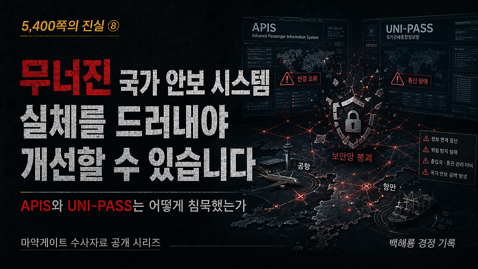
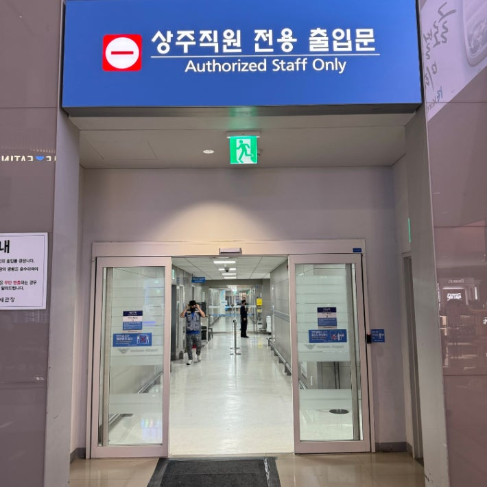
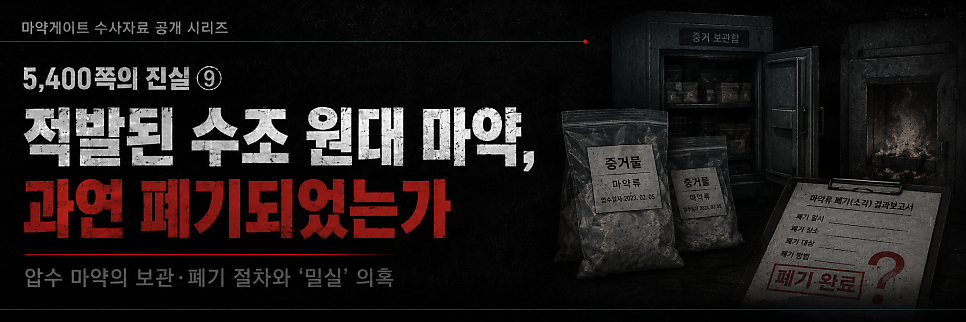

# [백해룡 경정 - 5,400쪽의 진실 ⑧] 무너진 국가 안보 시스템, 실체를 드러내지 않으면 개선할 수 없다.

> 출처: [https://m.blog.naver.com/backtcheck/224322136525](https://m.blog.naver.com/backtcheck/224322136525)  
> 작성일: 2026. 6. 21. 0:48

**APIS와 UNI-PASS는 어떻게 침묵했는가?**

마약게이트 여덟 번째 이야기를 국민과 역사의 법정에 보고드립니다.
열 번째 국민 보고를 마치고 나면, 5,400쪽의 수사기록은 전면 공개될 것입니다.
이번 글에서는 국경 안보를 책임져야 할 기관들이 어떻게 카르텔을 형성하고 안보망을 무력화해 왔는지, 그 실체적 기록을 공개합니다.

---

**1. 침묵한 AI 안보망: APIS와 UNI-PASS의 조직적 무력화**
대한민국의 공항과 항만 안보를 지탱하는 두 개의 거대한 기둥이 있습니다.
위험 인물과 테러·마약 등 금지 물품을 실시간으로 감시하고 가려내는 APIS, 그리고 국가 전체의 관세 및 화물 통제망인 UNI-PASS입니다.
이 시스템들은 국가정보원과 관세청이 실시간으로 핵심 정보를 공유하는
대한민국 국경 안보의 심장이자 최후의 보루입니다.
과거처럼 공무원들이 일일이 눈으로 보고 짐을 뒤져가며 안보를 지켜내는 시대는 지났습니다.
이제는 최첨단 AI 시스템이 승객과 화물의 방대한 정보를 종합 분석해,
행적과 잠재적 위험 요소를 사전에 파악하고 제거합니다.
대한민국이 자랑하는 전자통관시스템과 APIS는 그 우수성을 세계적으로 인정받아
여러 국가에 수출되었고, 한국형 전자정부 수출 사례로 회자될 만큼 완벽에 가까운 통제망이라고
관세청 스스로 자랑해왔습니다.
그러나 이토록 촘촘한 AI 그물망을 뚫고, 수십 명의 마약 운반책이 신체 곳곳에 마약을 부착한 채
들어왔습니다. 나무도마 속에 마약을 숨기고 특송화물로 들여오는 원시적 수법도 통과했습니다.
이것은 결코 시스템의 기술적 오류나 전산 마비가 아니었습니다.
세계 최고 수준의 안보 시스템을 운영하는 내부 공무원들이 조직적으로 범죄에 가담하여, 전산망에
의도적으로 허위값을 입력하는 방식으로 안보망을 무력화시켰기 때문에 가능한 일이었습니다.
가장 정밀하게 작동해야 할 국가 안보 시스템이, 그 시스템을 지키고 운영해야 할 내부자들의 기만과 조작에 의해 한순간에 눈먼 봉사로 전락한 것입니다.
이것은 국경 방첩망에 우연히 뚫린 구멍이 아닙니다.
내부의 적들에 의해 자행된 조직적인 국가 안보 해체 행위입니다.

---

**2. 내부에서 무너진 도미노: 동원된 부서들의 실체**
이 잔인한 국경 유린의 과정에는 국가기관의 핵심 부서들이 톱니바퀴처럼 맞물려 동원되었습니다.
인편 바디패킹 밀수를 프리패스시키기 위해, 위험 요소를 걸러내야 할 여행자통관국 정보분석과, 현장을 통제하는 여행자통관국 1개 과, 그리고 마약을 적발해야 할 마약조사 2개 과가 동원되었습니다.
나무도마 화물 밀수를 성공적으로 수행하기 위해 X-ray 검사 1개 과와 특송 담당 1개 과가 전산망을 조작하며 가담했습니다.
내부 직원의 비리를 감시하고 일벌백계해야 할 감사관실조차 이 침묵의 카르텔에 동원되었습니다.
물론 이 부서의 구성원 전체가 범죄자는 아닐 것입니다.
특정 인물 몇 명이 범죄를 주도하고, 대다수는 자리를 지키기 위해,
혹은 상부의 압박에 못 이겨 묵인하고 방조하는 태도를 취했을 것입니다.
그러나 결과는 참혹했습니다.
대한민국 국경 안보 전산 시스템은 철저하게 교란되었고 무력화되었습니다.
더 참담한 것은 이 안보 전산 시스템을 공유하며 국경을 넘어 적지에서 활동하던 기관들의 태도입니다.
마약 차단 업무를 목숨처럼 여기며 방첩과 대테러를 수행해야 할 국가정보원은
이 거대한 전산 교란 사태에서 단 한마디도 하지 않은 채 침묵을 지키고 있습니다.
그리고 검찰은 이러한 국가 안보 시스템의 붕괴를 바로잡기는커녕,
도리어 그들의 든든한 사법적 보증인이 되어주었습니다.
그렇게 나라의 안보망이 통째로 망가졌습니다.

---

**3. 1.6%의 거짓말, 그리고 자가 치유라는 환상**
눈에 보이지 않는 암덩어리들이, 그저 정권이 바뀌었다고 해서 스스로 자가 치유될 수 있겠습니까?
그렇게 믿는다면 너무도 순진한 발상이고, 너무도 어리석은 바람입니다.
국가 안보 전산 시스템을 조작하고 교란시킨 자들 중,
책임을 지고 자리에서 물러나거나 단죄를 받은 자는 단 한 명도 없습니다.
그들은 여전히 높은 자리에 앉아 무너진 시스템을 손에 쥐고 장악하고 있습니다.
저들의 세상에서 마약은 계속해서 시스템을 뚫고 들어와야만 합니다.
마약이 계속 사회적 문제가 되어야, 과거 국가 안보 시스템을 교란하고 붕괴시켰던
자신들의 치명적인 책임을 구조적 한계와 예산 문제 뒤에 숨길 수 있기 때문입니다.
마약이 계속 터져 나와야 그들은 “현실적·구조적 한계로 인해 세관의 여행객 휴대품 검사율이
1.6%에 불과하다”는 통계 뒤에 숨어 국민을 속일 수 있습니다.
내부자들에 의한 의도적인 시스템 조작과 교란이라는 본질을,
1.6%라는 숫자 뒤로 숨기고 있는 것입니다.

---

**4. 사관의 심정으로 국민의 법정에 섭니다**
사람들은 제게 묻곤 했습니다.
“왜 그렇게까지 하느냐. 그냥 눈 딱 감고 덮으면 편하지 않겠느냐?”
“정권이 바뀌었는데 좋은 게 좋은 것 아니냐?”
“부끄러운 과거를 들추어내 봐야 나라 망신만 시키는 것 아니냐?”
저는 일관되게 대답해 왔습니다.
이것은 단순히 밝혀내서 좋은 진실이 아닙니다.
지금 드러내지 않으면 국가 안보의 근간이 통째로 붕괴될 참혹한 진실이기 때문입니다.
영혼까지 매수된 매국노들이 국가 전산망을 유린하고 국경의 안보를 팔아넘기는 것을
내 눈으로 똑똑히 목격하고도 침묵한다면, 그것은 공무원이 아니라 범죄의 공범이기 때문입니다.
실체를 드러내지 않는다면 이 거대한 범죄는 권력 구조 속에서 정치적 계산에 따라 덮일 것입니다.
제도적 개선도 결코 이루어질 수 없을 것입니다.
결국 국가 안보와 국민의 안전 또한 지켜내기 어렵게 됩니다.

이제 저는 한 수사팀의 팀장에서, 화곡지구대장이라는 현장의 소임으로 돌아와
마지막 싸움을 시작합니다.
부끄럽게도, 제가 가진 5,400쪽의 수사기록은 이 참담한 진실을 온전히 담아내기에는
너무나 부족하고 미흡합니다.  저들의 조직적인 방해로 인해, 본건과 관련하여 단 한 번의 영장조차
제대로 집행해 보지 못했기 때문입니다.
그럼에도 저는 이 부족하고 미흡한 기록을 있는 그대로 국민의 법정에 제출하려 합니다.
이 기록을 세상에 내어놓는 것으로 저의 마지막 싸움을 시작하겠습니다.
권력이 왜곡하고 은폐하려 했던 대한민국의 국경 안보와 사법 정의의 실체를,
역사의 갈피마다 지워지지 않는 문장으로, 영상으로 새겨 넣으려 합니다.
아무도 책임지지 않는 참담한 현실 속에서,
이제 주권자인 국민께서 직접 감시자가 되어 이 무너진 밀실의 문을 함께 열어젖혀 주십시오.
판단은 국민들께서 해주십시오.

2026년 5월 17일 백해룡 경정 올림.

*백해룡 경정이 서울동부지방검찰청 앞에서 세관 마약수사 외압 의혹 합동수사단 파견 종료에 대한 소회를 밝히고 있다.*

---

다음 기록 예고

*https://blog.naver.com/backtcheck/224322141585*

> 🔗 [[5,400쪽의 진실 ⑨] 적발된 수조 원대 마약, 과연 폐기되었는가?](https://blog.naver.com/backtcheck/224322141585)
> 사라진 압수 마약과 밀실 거래의 실체 마약게이트 아홉 번째 이야기를 보고드립니다. 이제 열 번째 이야기...
