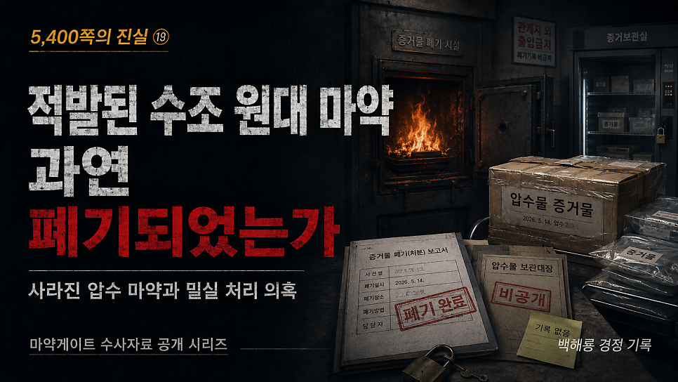
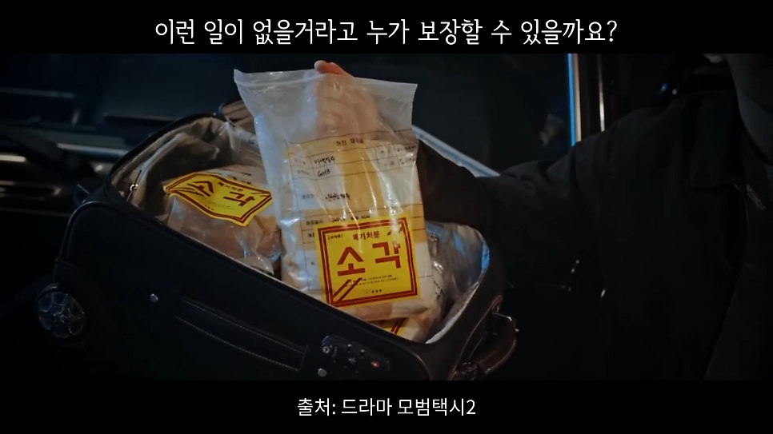
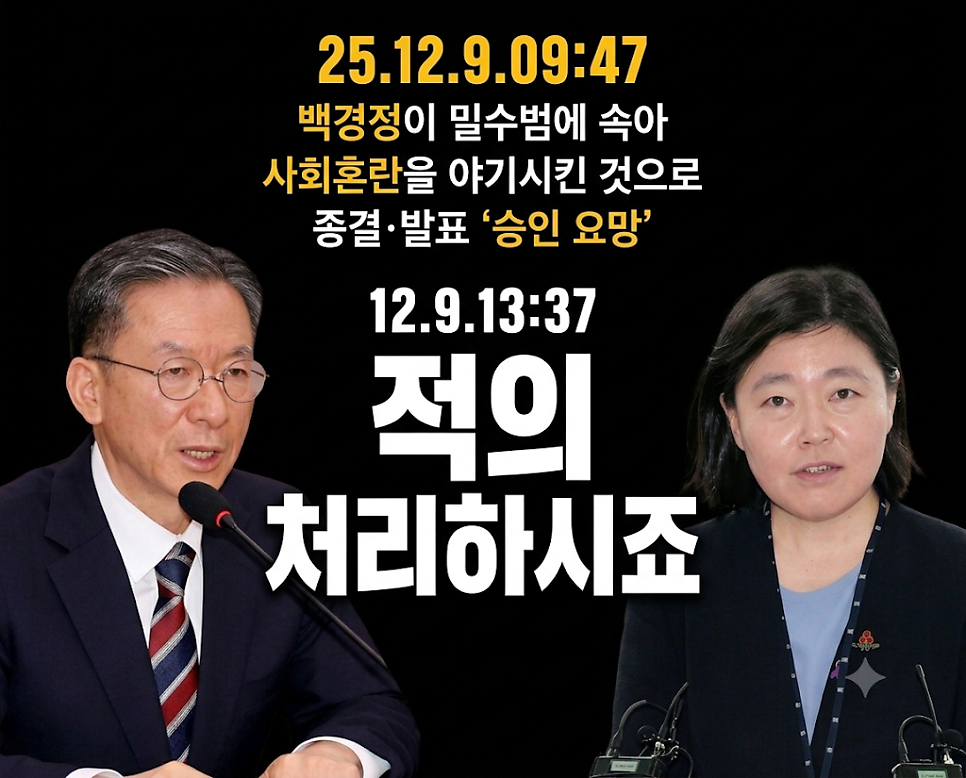
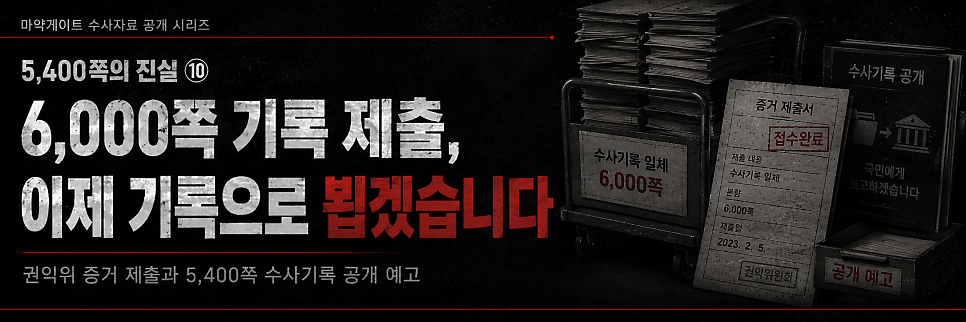

# [백해룡 경정 - 5,400쪽의 진실 ⑨] 적발된 수조 원대 마약, 과연 폐기되었는가?

> 출처: [https://m.blog.naver.com/backtcheck/224322141585](https://m.blog.naver.com/backtcheck/224322141585)  
> 작성일: 2026. 6. 21. 0:59

**사라진 압수 마약과 밀실 거래의 실체**

마약게이트 아홉 번째 이야기를 보고드립니다.  
이제 열 번째 이야기를 보고드리고 나면, 5,400쪽 수사기록은 역사와 국민 앞에 전부 공개될 것입니다.  
수 톤의 마약이 국경을 넘었는데, 처벌받은 국내 유통 관련자는 단 한 명도 없고,  
압수된 마약의 최종 행방은 묘연합니다.  
이제 우리는 진실을 알아야겠습니다.  
앞서 관세청, 국정원, 검찰, 경찰, 그리고 국가안보실 등이 스스로 무너뜨린  
국가 안보 시스템의 붕괴를 말씀드린 바 있습니다.  
오늘은 그 통제력을 상실한 시스템 속에서 시가 1조 원이 넘는 실물 마약들이 어떻게  
‘서류상의 마법’으로 사라지는지, 그 참담한 의혹의 실태를 보고드립니다.

---

**1. 수조 원대 마약, 적발할 때만 ‘최대 규모’입니까?**  
강릉 옥계항 1.69톤, 부산 신항 900kg.  
대한민국 역사상 전례 없는 천문학적인 코카인이 국경을 뚫고 들어왔습니다.  
사법 당국은 ‘사상 최대 적발’이라며 대대적으로 홍보했지만, 돌아온 결과는 기가 막힙니다.  
옥계항 사건은 필리핀 선원들만 처벌받았고,  
부산 신항 사건은 처벌자 0명이라는 결론으로 끝났습니다.  
검찰과 관세청 주관 합동 수사팀이 내놓은 결론은 고작 ‘내국인 관련자 없음’이었습니다.  
이 천문학적 규모의 압수 마약은 대체 어떻게 성분 감정이 되었고, 또 어떻게 처리된 것입니까?

---

**2. 마약 폐기, 법적 지휘권자는 오로지 검사입니다.**  
마약류는 단순한 증거물이 아닙니다.  
유출 시 치명적인 독극물입니다.  
대한민국 형사소송법과 마약류관리법은 이를 엄격히 관리하도록 규정합니다.  
형사소송법 제219조에 따르면, 검사의 사전 지휘가 없으면 1g도 폐기할 수 없습니다.  
검찰압수물사무규칙 제29조에 따르면, 검사는 폐기 시 엄격한 폐기조서를 작성해야 합니다.  
마약류관리법 제53조에 따르면, 영상 녹화와 참관인 연명 날인이 필수입니다.  
하지만 사건이 종결되는 순간, 이 엄격한 절차는 견제의 눈길에서 벗어나 밀실로 숨어듭니다.

---

**3. 나무 캐비닛에 방치된 수조 원대 독극물**  
몰수 마약류의 보관 실태는 경악 그 자체입니다.  
영월군 보건소는 일반 업소용 냉장고에,  
홍천·화성 보건소는 쉽게 파손되는 나무 캐비닛에 마약을 방치했습니다.  
춘천 보건소에서는 10억 원 상당의 필로폰이 통째로 사라지기도 했습니다.  
식약처의 현장 전수 조사는 지난 5년간 전무했습니다.  
사법 체계의 끝자락에서 천문학적 가치의 독극물이 사실상 길거리에 방치되어 있는 셈입니다.

---

**4. 수사기관 내부의 마약 유출 잔혹사**  
“사법 절차를 거친 독극물이니 당연히 안전하게 소각되겠지”라고 순진하게 믿고 계십니까?  
서울지검 이00 수사관, 군산지청 방00 수사관처럼 압수물 저장소에 있어야 할 마약이  
검찰 수사관들의 손을 타고 암시장으로 흘러 들어간 전례가 있습니다.  
이처럼 언론에 알려진 내용은 빙산의 일각일 것입니다.  
감시자 없는 밀실 속에서 성분 조작이나 바꿔치기가 없었다고 누가 장담할 수 있습니까.  
국민 보호를 위해 폐기했다는 폐기조서와 영상조차 확인되지 않는 이 상황.  
우리는 정말 이대로 몰라도 괜찮은 것입니까.

---

**5. 주인 없는 진실의 행방을 묻습니다**  
저는 헌법이 허용한 국민의 권리로 사법 당국에 요구합니다.  
**인계 이력 공개**  
대규모 압수물의 정확한 인계 날짜, 보관 사진 및 이력, 성분 분석 문서를 투명하게 공개하십시오.  
**실물 영상 공개**  
소각로에 투입되어 완전히 해체되는 무편집 실물 폐기 영상 기록을 공개하십시오.  
**책임자 명단 공개**  
폐기 과정을 최종 지휘한 검사와 참관 공무원들의 실명 명단을 공개하십시오.

진실을 덮으려는 자가 곧 공범입니다.  
2025년 12월 9일, 임은정 서울동부지검장은 정성호 법무부장관의 승인을 받아  
이 참담한 마약게이트를 ‘무혐의’로 종결해 버렸습니다.  
장관의 “적의 처리 하시지요”라는 승인 직후, 단 23분 만에 발표된 대국민 수사 결과의 요지는  
가관이었습니다.  
그들은 이 거대한 마약게이트 사건을 저와 우리 수사팀이 여성 밀수범 2명의 ‘진술 모의’에 속아  
사회적 혼란을 일으킨 단순 해프닝이라 규정했습니다.  
오로지 디지털 증거만으로 특정한 176kg 밀수의 적나라한 흔적도,  
수사기록 곳곳에 박혀 있는 세관과 검찰의 범죄 가담 증거도 그 누구도 보려 하지 않았습니다.  
결국 저와 팀원들이 고립무원의 상황에서 피땀으로 일궈낸 성과는 그저 사고로 치부되었습니다.  
더 이상 “수사할 기회를 달라”고 호소하지 않겠습니다.  
이제 저는 공직자의 마지막 소임으로, 이 참담한 마약게이트를 역사와 국민의 법정에 세우려 합니다.  
오직 국민 여러분께서 판단하고 심판해 주십시오.  
주인 없는 진실의 행방, 이제 역사와 국민의 법정에서 끝까지 따져 묻겠습니다.

2026년 5월 23일 백해룡 경정 올림.

---

다음 기록 예고

*https://blog.naver.com/backtcheck/224322151139*

> 🔗 [[5,400쪽의 진실 ⑩]이제 기록을 국민과 역사의 법정에 제출합니다.](https://blog.naver.com/backtcheck/224322151139)
> 6,000여 쪽 공익신고, 그리고 마지막 심호흡 열 번째 이야기를 보고드립니다. 아홉 번째 이야기를 전해드린...
