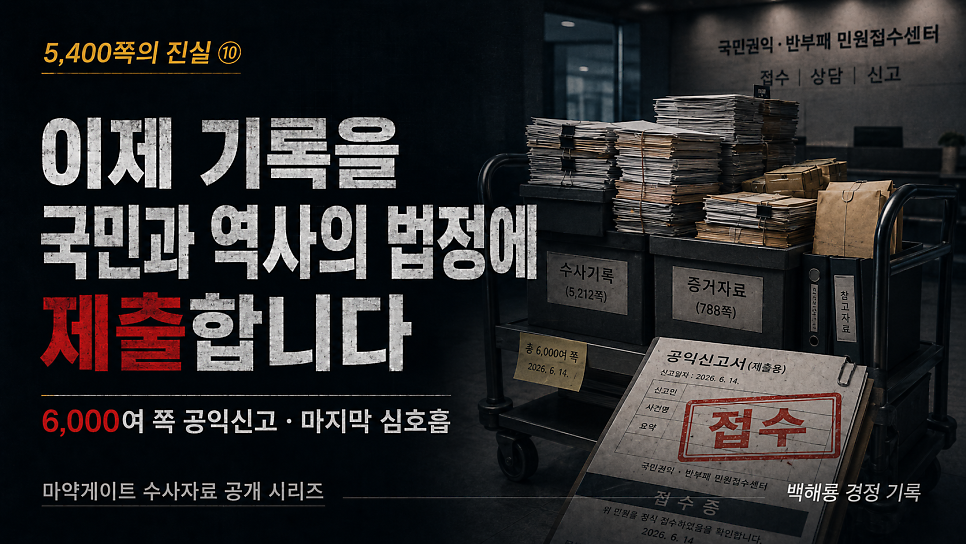
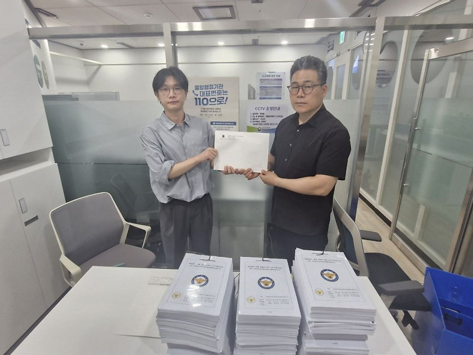
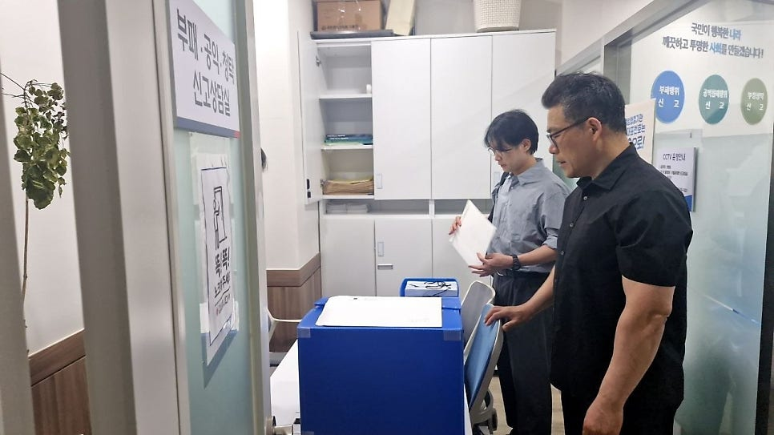
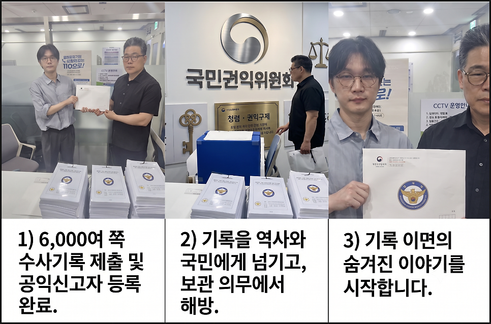

# [백해룡 경정 - 5,400쪽의 진실 ⑩]이제 기록을 국민과 역사의 법정에 제출합니다.

> 출처: [https://m.blog.naver.com/backtcheck/224322151139](https://m.blog.naver.com/backtcheck/224322151139)  
> 작성일: 2026. 6. 21. 1:19

**6,000여 쪽 공익신고, 그리고 마지막 심호흡**

열 번째 이야기를 보고드립니다.  
아홉 번째 이야기를 전해드린 지 어느덧 20여 일이 훌쩍 흘렀습니다.  
2026년 6월 12일 금요일,  
저는 총 6,000여 쪽의 수사기록을 국민권익위원회에 증거로 제출하고 공익신고자 등록을 마쳤습니다.  
수사기록 5,400여 쪽과 수사과정에서 작성된 공문서를 포함한 기록입니다.  
“왜 진작 공익신고를 하지 않았느냐”고 묻는 분들이 계십니다.  
국가 안보와 국민의 안전을 지키는 공직자로서,  
진실을 당당히 쥐고 있다면 그 자체로 충분하다고 믿었습니다.  
법적 보호장치라는 그림자 뒤에 숨는 것이 오히려 부끄럽게 느껴지기도 했습니다.

---

**1. 지난 1,000일을 견딘 이유**  
지난 1,000일 동안 온갖 공격과 핍박을 견디며 인내했던 결정적인 이유는 단 하나였습니다.  
오직 수사할 수 있는 기회를 얻기 위함이었습니다.  
너무나 당연한 공직자의 바람이었지만, 끝내 허락되지 않았습니다.  
“백 경정은 외압 사건의 당사자이므로 이해충돌 소지가 있다. 수사에서 배제해야 한다.”  
마약게이트가 드러나는 것을 원치 않았던 자들은 이 치졸한 프레임을 짜놓고 언론과 여론을 선동하며 사실을 호도했습니다.  
저는 그 프레임에 걸려들지 않기 위해 수많은 고소·고발과 인신공격 속에서도 맞서 다투지 않았습니다.  
스스로를 지킬 최소한의 안전장치조차 만들지 않은 채 맨몸으로 버텼습니다.  
오직 수사선상에 다시 서서 마약 카르텔의 실체를 드러내고, 재발 방지를 위한 초석을 다지기 위해서였습니다.

---

**2. 더 이상 수사할 기회를 달라고 호소하지 않겠습니다**  
이제 더 이상 국가기관을 향해 “수사할 기회를 달라”고 구걸하듯 호소하지 않겠습니다.  
동부지검 합수단 파견 기간 동안, 저는 합수단 구성원이 누구인지조차 알 수 없었습니다.  
단 한 번의 수사 회의에도 참여하지 못했고, 합수단이 취급했던 수사자료는 단 한 장도 공유받지 못했습니다.  
파견 후 첫 한 달 동안은 KICS, 즉 형사사법정보시스템 사용마저 차단당했습니다.  
3개월여의 파견 기간 중 실제 기록을 작성할 수 있었던 기간은 단 50여 일이었습니다.  
저를 포함한 수사팀 5명이 온전하게 수사할 수 있었던 기간은 고작 40일에 불과했습니다.  
통신수사 결재선은 파견 내내 굳게 닫혀 있어, 통신 가입자의 인적 사항을 확인하는 것조차 허락되지 않았습니다.  
물론 압수수색 영장은 청구조차 되지 않았습니다.

---

**3. 손발을 묶고 눈을 가린 채 남긴 기록**  
손발을 묶고 눈을 가린 채, 숨조차 쉬기 힘들었던 최악의 고립 속에서 우리 수사팀이 피땀으로 만들어낸 진실의 흔적이 바로 이 기록입니다.  
이 열 번째 이야기를 끝으로, 저는 수사기록을 보관하고 관리해야 하는 천형 같은 무거운 의무에서 벗어나려 합니다.  
조만간 5,400여 쪽의 이 참담한 진실의 기록을 권력의 밀실에서 꺼내 국민과 역사의 법정에 모두 공개하겠습니다.  
이제 이 기록의 처분은 국민 수사대와 역사의 법관에게 맡기려 합니다.  
곧 기록으로 뵙겠습니다.  
그리고 기록 이면에 감춰진 이야기들을 차근차근, 담담하게 해나가려 합니다.  
부디 진실의 증인이 되어 주십시오.  
그리고 함께해 주십시오.  
열 번째 심호흡을 마치며,

2026년 6월 14일 백해룡 경정 올림.

---

다음 기록 예고

> 🔗 [영화보다 더 영화 같은 사건의 수사 기록](https://blog.naver.com/backtcheck/224322150755)
> 영화보다 더 영화 같은 사건, 그리고 수사의 기록... 마약게이트 수사 자료 총론-해설본을 공개합니다. 저...
