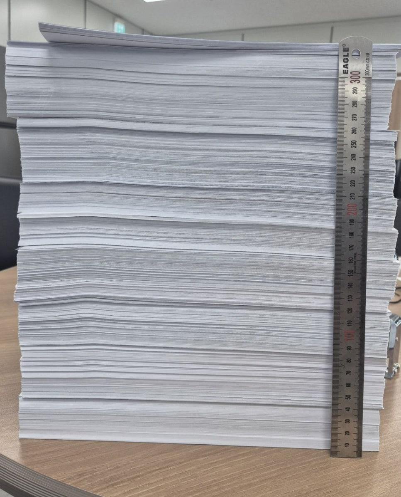
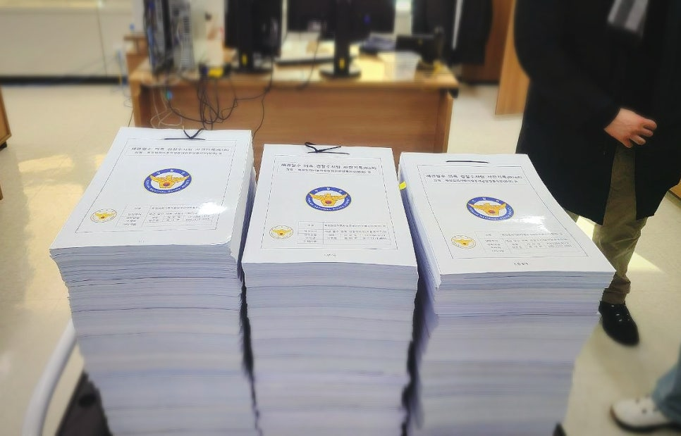

# [PDF 수사자료집 공개] 백해룡 경정 마약게이트 수사자료(총론 - 해설본 파일 202606)

> 출처: [https://m.blog.naver.com/backtcheck/224322171289](https://m.blog.naver.com/backtcheck/224322171289)  
> 작성일: 2026. 6. 21. 2:10

**영화보다 더 영화 같은 사건, 그리고 수사의 기록..**  
**수사기록 공개에 앞서, 마약게이트 수사 자료 총론-해설본을 공개합니다.**

저는 오늘부터 제가 정리한 **마약게이트 수사자료**를 이 블로그를 통해  
국민 여러분께 공개하고자 합니다.  
이 자료는 단순한 주장이나 감정의 기록이 아닙니다.  
제가 영등포경찰서 형사과장으로서 말레이시아발 대규모 마약 밀반입 사건을 수사하며 확인한 내용, 이후 세관 연루 의혹과 수사 외압, 수사팀 해체와 좌천, 동부지검 합수단 파견 과정에서 겪고 확인한  
내용을 공개 가능한 범위에서 정리한 것입니다.  
**저는 이 사건을 폭로하고 싶었던 것이 아니라, 제도 안에서 끝까지 수사하고 싶었습니다.**  
**지난 1,000일 동안** 저는 한 경찰공무원으로서 할 수 있는 적법한 절차를 모두 밟으려 했습니다.  
보고했고, 요청했고, 지휘했고, 영장을 신청했고, 문제를 제기했고, 결국 공익신고를 마쳤습니다.

제가 가진 역할과 에너지는 이제 거의 소진되었습니다.  
이제 저는 더 이상 “수사하게 해달라”고 호소하지 않으려 합니다.  
공무원과 국가기관은 국민 위에 존재하는 권력이 아닙니다.  
검찰이든 경찰이든 어느 기관이든, 그 조직과 구성원은 국민에게 봉사하고  
공익을 실현하기 위한 도구이자 플랫폼이어야 합니다.  
그 기본이 무너질 때, 국민은 기록을 통해 그 과정을 확인할 권리가 있습니다.  
제가 지금 하려는 일은 싸움의 깃발을 다시 드는 일이 아닙니다.  
투사의 복장을 입고 누군가를 향해 외치는 일도 아닙니다.  
**정년을 앞두고 있는 쇠락한 한 경찰공무원**으로서,  
헌법과 법률이 공직자에게 요구한 마지막 의무를 다하려는 것입니다.  
모두가 외면하거나 버린 진실이 제 앞에 남겨져 있습니다.  
현장을 떠난 수사관 한 사람이 혼자 쥐고 있기에는 너무 무거운 진실입니다.  
그래서 저는 이 진실을 국민 여러분께, 그리고 역사의 법관 앞에 조심스럽게 내려놓으려 합니다.

갈 곳 없는 5,400쪽의 수사기록  
**왜 이 수사자료를 공개하는가?**  
**결론은 정해져 있었고, 과정은 은폐로 가득했습니다.**

이 사건은,  
'대한민국의 하늘 국경인 공항을 통해 대규모 마약이 어떻게 들어올 수 있었는가', 그리고 '그 과정을 확인하려던 수사가 왜 멈춰 서야 했는가'에 대한 근본적인 질문에서 부터 시작됩니다.

구체적으로 우리는 다음의 질문들에 대해 답을 찾아야 합니다.  
**대한민국의 국경 관리 시스템이 왜 이토록 무력화되었는지,**  
**권력기관의 안보 책임과 수사 책임은 도대체 어디로 사라졌는지,**  
**국가 시스템이 과연 누구를 위해 작동하고 있는지,**  
**명백한 부실과 은폐가 있음에도 누구도 책임지거나 처벌받지 않은 이유가 무엇인지,**  
**지시 명령을 충실히 수행해 혁혁한 성과를 냈던 수사팀은 왜 돌연 해체되었고 단 한 명도 포상받지 못했는지, 그리고 수사 책임자는 왜 수사권을 박탈당한 채 좌천되어야 했는지,**  
**국가기관이 공익과 진실을 보호하는 대신, 자신들에게 불편한 진실을 어떤 방식으로 조직적으로 암장했는지.**

**자료에는 무엇이 담겨 있는가?**

동부지검 백해룡 수사팀이 수사한 5,400쪽의 **기록**  
이번에 공개하는 수사자료 총론은 크게 다음 내용으로 구성되어 있습니다.  
**1. 수사기록 공개의 당위성**  
자료집은 먼저 왜 이 자료를 국민 앞에 공개하고 보존해야 하는지 설명합니다.  
확정판결이 난 사건과 이미 종결된 사건에 대해,  
국민은 국가기관의 판단이 어떤 기록과 절차 위에서 이루어졌는지 확인할 권리가 있습니다.  
국가기관이 “실체가 없다”고 결론 내렸다면, 그 결론 역시 국민 앞에서 검증될 수 있어야 합니다.  
**2. 마약게이트 주요 타임라인**  
자료에는 2023년 7월 수사 착수부터 말레이시아 조직원 검거, 세관 연루 의혹 인지, 명동 현장검증,  
언론 브리핑 중단, 사건 이첩 압박, 영장 반려, 수사팀 해체와 좌천에 이르기까지의 흐름이  
시간순으로 정리되어 있습니다.  
처음에는 나무도마 화물 밀수 사건을 추적하던 수사였습니다.  
그러나 수사 과정에서 신체에 필로폰을 부착한 운반책들이 공항을 통해  
반복적으로 입국했다는 정황과, 세관 조력 의혹이 확인되기 시작했습니다.  
그때부터 사건은 단순한 마약 밀수 사건이 아니라, 국가 시스템이 어디에서 멈췄는지를  
묻는 사건이 되었습니다.  
**3. 인천지검과 중앙지검 수사의 쟁점**  
자료는 인천지검과 서울중앙지검의 초기 수사 과정에 대해 중요한 의문을 제기합니다.  
왜 공범들을 즉시 추적하지 않았는가.  
왜 출국 차단과 CCTV 확인 같은 기본적인 수사 조차 이루어지지 않았는가.  
왜 확보 가능한 자료들이 기록에서 누락되었는가.  
왜 특정된 인물들이 ‘불상자’로 처리되었는가.  
마약 밀수 사건에서 공범 추적과 증거 확보는 수사의 기본입니다.  
그 기본이 왜 작동하지 않았는지는 국민이 반드시 확인해야 할 대목입니다.  
**4. 나무도마 화물 밀수와 통관 시스템 문제**  
자료에는 나무도마 안에 필로폰을 은닉해 항공 특송으로 반입한 사건도 정리되어 있습니다.  
나무도마는 식품용 기구로 분류될 수 있어 수입신고와 검사 절차가 필요한 물품입니다.  
그런데 대량의 나무도마 화물이 반복적으로 통관되었고,  
그 과정에서 검사 생략과 통관 요건 누락 의혹이 제기됩니다.  
정상적인 행정 절차라면 쉽게 지나가기 어려운 화물이 어떻게 통과되었는지,  
관련 통관 담당자들은 어떤 판단을 했는지, 전자통관시스템은 왜 제대로 작동하지 않았는지  
기록을 통해 확인할 필요가 있습니다.  
**5. 동부지검 합수단 발표에 대한 반박**  
동부지검 합수단은 세관 연루 의혹에 대해 혐의가 없다고 발표했습니다.  
그러나 자료집은 합수단이 핵심 쟁점인 APIS, 전자통관시스템, CCTV, 현장검증조서,  
압수수색 필요성 등 객관적 자료를 충분히 검토하지 않고, 운반책 진술의 신빙성을 흔드는 방식에  
집중했다고 지적합니다.  
특히 ‘진술 모의’라는 프레임에 대해, 자료집은 현장검증조서와 피의자별 독립 진술을 근거로  
반박하고 있습니다. 수사기관이 진실을 밝히는 대신, 이미 확보된 기록의 의미를 축소하거나  
지워버렸다면 그것은 다시 검증되어야 합니다.  
**6. 범죄인지서와 압수수색영장 신청서**  
자료에는 말레이시아 조직, 관세청, 검찰청 관련 범죄인지서와  
관세청 및 검찰청 대상 압수수색영장 신청서의 주요 내용도 포함되어 있습니다.  
이는 단순한 의혹 제기 문서가 아닙니다.  
수사팀이 어떤 범죄 혐의를 인지했고, 어떤 자료가 필요하다고 판단했으며,  
왜 강제수사가 필요하다고 보았는지를 보여주는 자료입니다.  
이 문서들은 한때 수사기관 내부에서 움직였던 질문들이며,  
이제는 국민 앞에서 검증되어야 할 질문들입니다.  
**이 기록은 누구를 위한 것인가?**

이 자료는 저 개인을 위한 방어문이 아닙니다.  
또 누군가를 정치적으로 공격하기 위한 문서도 아닙니다.  
이 자료는 국민을 위한 것입니다.  
마약은 한 번 국경을 넘으면 누군가의 몸과 가정과 삶을 파괴합니다.  
대규모 마약이 하늘 국경인 공항을 통해 밀수입되었습니다. 그런데 국가 안보시스템인 전산망을 교란시켜 통과되었다면 그것은 단순한 밀수 사건이 아닙니다. 국기 문란을 넘어 국가 붕괴를 초래할 수 있는 지극히 위험천만한 사건입니다.  
국가 안보 전산시스템이 어디에서, 어떻게, 조작되었고,  
왜, 누가 작동 불능의 상태로 만들었는지 확인해야 하는 중대한 공적 사안입니다.  
저는 이제 이 진실을 혼자 들고 있지 않으려 합니다.  
국민 여러분, 그리고 네티즌 수사대 여러분께 이 자료를 맡깁니다.  
역사의 법관 앞에 이 자료를 제출합니다.  
부디 이 자료를 읽어 주십시오.  
무엇이 확인된 사실인지, 무엇이 기록으로 남아 있는지,  
그리고 무엇이 여전히 국민의 판단을 기다리고 있는지 살펴봐 주십시오.  
**공개의 원칙**

저는 이 블로그를 통해 자료를 공개하면서 몇 가지 원칙을 지키겠습니다.  
첫째, 기록과 증거로 확인된 사실, 기록과 증거를 분석하여 해석한 판단과 추정을 구분하겠습니다.  
둘째, 기록으로 확인 가능한 내용과 수사로 밝혀져야 할 구체적 내용을 구분하겠습니다.  
셋째, 공익과 무관한 개인정보와 사생활 등이 공개되지 않도록 각별히 유의하겠습니다.  
넷째, 감정이 아니라 기록으로 말하겠습니다.  
다섯째, 국민께서 이해하실 수 있도록 가능한 한 쉽게 설명하겠습니다.

마약게이트 사건 기록은 구조가 복잡하고 쉽게 이해하기 어렵습니다.  
그래서 저는 수사자료집 전체를 공개하는 것에 앞서, 주요 쟁점별로 나누어 '해설본-총론'을 먼저 올려 국민 여러분께 설명드리겠습니다.  
**국민 여러분께 부탁드립니다.**

**함께해 주십시오.**

저는 제도 안에서 제가 할 수 있는 절차를 거쳤습니다.  
이제 남은 일은 이 기록이 사라지지 않도록 하는 것입니다.  
그리고 이 기록이 국민과 역사 앞에서 확인되도록 하는 것입니다.  
저는 오늘 이 자료를 국민 앞에 제출합니다.  
투사의 언어가 아니라 공직자의 마지막 소임으로,  
분노가 아니라 기록으로,  
호소가 아니라 사실 적시로,  
제가 감당해 온 이 무거운 진실을 내려놓습니다.  
진실은 저절로 드러나지 않습니다.  
그러나 기록된 진실은 언젠가 반드시 누군가의 손과 눈에 닿습니다.  
그 손과 눈이 국민의 손과 눈이기를 바랍니다.  
또한 수사 기록을 통한 판단이 역사에 남기를 바랍니다.

2026년 6월 20일 백해룡 경정 올림

첨부: 마약게이트 수사기록 총론 해설 PDF

📎 **첨부파일:** [마약게이트_수사기록_총론_해설_Set.pdf](files/마약게이트_수사기록_총론_해설_Set.pdf)

다음 기록 예고...
