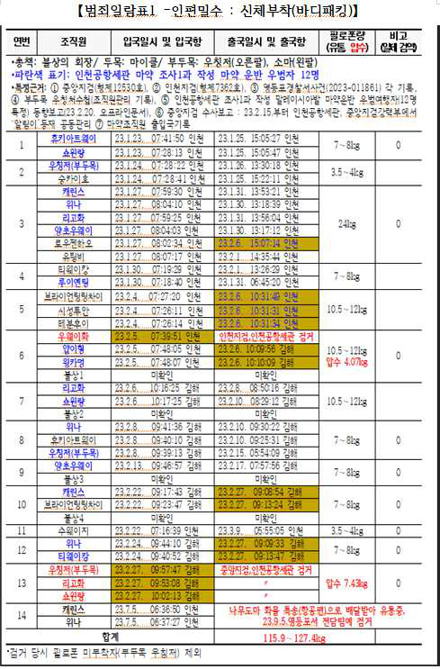
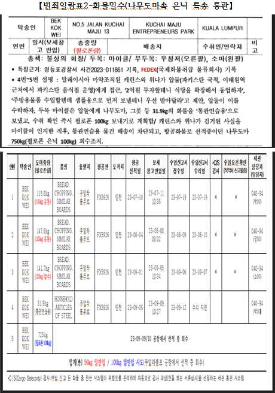

# 첨부 이미지 자료 설명 (범죄일람표·검거/압수 사진)

> ⚠️ 이 문서는 백해룡 경정이 공개한 「마약 게이트 수사 자료집」의 내용을 정리한 것입니다. 모든 자료는 해당 블로그 글을 바탕으로 합니다.

## 0. 개요

이 문서는 자료집에 이미지(스캔본)로 첨부된 7개 PNG 파일을 각각 열어 보이는 내용을 전사·설명한 것입니다. 자료집 목차상 첨부는 크게 두 갈래입니다.

- **범죄일람표** 2종 — ① 인편밀수(여행자 신체 부착·바디패킹), ② 화물밀수(나무도마 속 은닉 특송 통관)
- **검거·압수 당시 사진** — 신체 부착 정황, 검거 피의자, 압수물(메스암페타민/필로폰), 특송화물 개봉 장면 등

전사 과정에서 확인된 사항으로, **이미지 01과 06은 동일 파일**(범죄일람표1)이고 **이미지 04와 07도 동일 파일**(범죄일람표2)입니다. 즉 자료집은 같은 일람표 이미지를 "범죄인지서 첨부"와 "관세청 압수수색영장 첨부"에 중복으로 사용하고 있습니다. 따라서 실질적으로는 5종의 서로 다른 이미지로 구성됩니다.

> 본 문서는 인물의 실명·얼굴 등 민감정보를 묘사하지 않습니다. 사진 중 인물이 식별될 수 있는 부분은 "검거 피의자 사진", "신체 부착 정황" 등으로만 일반화하여 기술합니다. 자료집 표에 일부 운반책의 이름으로 기재된 항목은 자료집 표기를 그대로 옮기되, 고유명사 여부가 불확실한 표기는 자료집 표기임을 전제로 인용합니다.
>
> **이미지 표시 방침**: 비민감 자료인 **범죄일람표(표) 이미지(01·04)만 문서에 인라인으로 표시**하고, 검거·압수 사진(02·03·05)은 인라인으로 표시하지 않습니다. 모든 이미지 원본은 [`images/`](images) 폴더에서 직접 확인할 수 있습니다.

| 파일명 | 분류(자료집 목차 기준) | 종류 | 비고 |
|---|---|---|---|
| 01_범죄인지서_첨부1.png | 범죄일람표1 — 인편밀수 | 표 | 06과 동일 |
| 02_범죄인지서_첨부2.png | 검거/압수 사진 (인편 밀수1) | 사진 | 우웨이화 관련 |
| 03_범죄인지서_첨부3.png | 검거/압수 사진 (인편 밀수2) | 사진 | 양공여행자 관련 |
| 04_범죄인지서_첨부4.png | 범죄일람표2 — 화물밀수 | 표 | 07과 동일 |
| 05_범죄인지서_첨부5.png | 검거/압수 사진 (화물 밀수) | 사진 | 나무도마 압수 |
| 06_관세청영장_범죄일람표1.png | 범죄일람표1 — 인편밀수 | 표 | 01과 동일 |
| 07_관세청영장_범죄일람표2.png | 범죄일람표2 — 화물밀수 | 표 | 04와 동일 |

---

## 1. 이미지 01 = 06 — 「범죄일람표1 · 인편밀수: 신체 부착(바디패킹)」

> ※ 저해상도 스캔이라 표 내부 글자는 흐릴 수 있습니다. 아래 전사 내용을 함께 참고하세요. (이미지 01 = 06, 동일 파일)

### 제목·머리글

상단 제목은 **「범죄일람표1 - 인편밀수 : 신체 부착(바디패킹)」**. 표 위 안내문에 따르면 이 일람표는 여행자가 마약을 **신체에 부착**하여 들여오는 방식(바디패킹)을 정리한 것이라고 자료집은 기록합니다. 머리글의 표기를 옮기면 다음과 같습니다.

- 충색(總色, 색 범례): **불상의 회장 / 두목·마이클 / 부두목·우칭저(오른팔) / 소마(왼팔)** — 색으로 인물 관계를 구분
- 색 범례: 입국일시 및 입국항 / 출국일시 및 출국항 / **필로폰 운반 중량** / 비고
- 특통표기(특이 통관 표기): 인천공항세관 마약조사1과 작성 **마약 운반 우범자 12명**
- 통제표기로 사건번호 인용: **중앙지검 2023형제12530호**, **인천지검 2023형제7362호**, **영등포경찰서 사건(2023-011861)** 각 기록
- 부두목 우칭저(우정저) 조직원들과 인천공항세관 마약조사1과 작성 일제(일제 점검) 우범여행자 12명 표기 의미
- 검거 표기: 2023.3.20. 오피스텔 검거, 23.2.15. 보낸 인천공항세관·중앙지검결과보고 기록

> ※ 본문(범죄인지서)에서 정리된 인천지검 2023형제7362호(우웨이화), 중앙지검 2023형제12530호(우칭저 등), 영등포서 사건과 직접 연결되는 일람표입니다. 즉 이 표는 자료집이 "마약조직 운반책 12명"으로 규정한 인물들의 입·출국 동선과 운반 중량을 시계열로 배열한 것입니다.

### 표 본문 (자료집 표기 전사)

표는 연번(連番) 1~14, 각 연번마다 복수의 운반책 행을 두고, 입국·출국 일시/공항, 필로폰 운반 중량, 비고를 적었습니다. 날짜는 모두 2023년(표기 "23.")입니다. 색 음영(붉은·황색)이 칠해진 행은 자료집이 강조한 부분으로 보입니다.

| 연번 | 운반책(자료집 표기) | 입국(일시·공항) | 출국(일시·공항) | 운반 중량 | 비고 |
|---|---|---|---|---|---|
| 1 | 후이여능판 / 쇼란량 | 23.1.23. 07:41:50 인천 외 | 23.1.25. 15:05:27 인천 | 7~8kg | 0 |
| 2 | 유정퇴 / 충쟈오쿤 | 23.1.24. / 23.1.24. 인천 | 23.1.26. 인천 | 3.5~4kg | 0 |
| 3 | 캐린스 / 위나 / 양호우웨이 / 쇼령퇴 | 23.1.27.~28. 인천 | 23.1.31.~2.1. 인천 | 7~8kg | 0 |
| 4 | 루이연링 / 보라이언링핫차이 | 23.1.30. 인천 | 23.1.31. 인천 | 7~8kg | 0 |
| 5 | 시성투쿤 / 텐분우이 | 23.2.4. 07:27:20 인천 | **23.2.6. 10:31:40 인천** | 10.5~12kg | 0 |
| 6 | **우웨이화** / 얄이형 / 왕카령 | 23.2.5. 07:39:51 인천 외 | **23.2.6. 10:59:56 / 10:10:09 인천·김해** | 10.5~12kg | **압수 4.07kg** / 「인천지검·인천공항세관 검거」 |
| 7 | 리고화 / 쇼위량 | 23.2.6. 인천·김해 | 23.2.10. 김해 | 7~8kg | 0 |
| 8 | 위나 / 후이아트쿠이 / **우칭저(부두목)** / 양쇼우웨이3 | 23.2.8.~13. 김해 | 23.2.10.~17. 김해 | 7~8kg | 0 |
| 9 | (미확인 행) | 미확인 | 미확인 | – | 0 |
| 10 | 캐린스 / 보라이언링핫차이 | 23.2.22. 김해 | **23.2.27. 09:06:54 / 09:13:24 김해** | 7~8kg | 0 |
| 11 | 불상4 / 수밀이쿠 | 23.2.22. 김해 | 23.3.9. 인천 | 3.5~4kg | 0 |
| 12 | 위나 / 티엘이쟝 | 23.2.27. 김해 | **23.3.2. 09:13:47 김해** | 7~8kg | 0 |
| 13 | **우칭저(부두목)** / 리고화 / 쇼란량 | 23.2.27. 09:57:47 김해 외 | **「중앙지검·인천공항세관 검거」** | – | **압수 7.43kg** |
| 14 | 캐린스 / 위나 | 23.5. 인천 | 23.7. 인천 | – | (비고: 나무도마 등 특송 항공편으로 배달받아 유통 중 / 23.9.5. 영등포서 전담팀에 검거) |
| **합계** | | | | **115.9~127.4kg** | |

> 표 하단 주석(자료집 표기): "**검거 당시 필로폰 미부착자(부두목 우칭저) 제외**". 즉 합계 중량은 검거 시점에 신체 부착 상태였던 운반분 기준이며, 부두목으로 표기된 인물의 미부착 건은 제외했다는 취지로 읽힙니다.

**본문과의 연결.** 이 표는 자료집이 "마약조직이 여행자(인편)를 동원해 약 115~127kg 규모의 필로폰을 신체 부착 방식으로 반복 반입했다"고 주장하는 핵심 근거표입니다. 연번 6(우웨이화, **압수 4.07kg**)은 인천지검 2023형제7362호, 연번 13(우칭저 등, **압수 7.43kg**)은 중앙지검 2023형제12530호 검거 건과 대응합니다(우웨이화 징역 8년, 우칭저 등 징역 8~11년). 자료집은 이 일람표를 통해 "세관(인천공항세관 여행자통관 라인) 연루 및 수사 외압" 의혹을 제기하며, 이를 "검찰의 셀프수사에 의한 은폐"라고 반박합니다.

---

## 2. 이미지 02 — 검거/압수 사진 ① (인편 밀수 · 우웨이화 관련)

- **상단 제목**: 「인편 밀수1 - 2023. 2. 5. 검거 사진」
- **머리글(자료집 표기)**: "(1) 우웨이화 검거 당시 모습(인천지검 2023형제7362호 사진). 이은스케어에 의해 메스암페타민 반응 보인 휴대용품에서 사진 없음"
- 사진 캡션: **230285 말레이시아(레) 장승여행자 메스암페타민 양성 외 2점** / 사진 ①

### 읽어낸 내용

가운데 빨간 상의를 입은 인물의 다리·하반신을 여러 각도에서 촬영한 사진 4컷과, 신발 2컷이 배치되어 있습니다. 각 사진 캡션은 다음과 같습니다.

| 위치 | 캡션(자료집 표기) | 추정 내용 |
|---|---|---|
| 좌상 | [메스암페타민 신변손녀(좌)] | 다리에 부착된 은닉물 정면 |
| 우상 | [메스암페타민 신변손녀(우)] | 다리 측면 |
| 좌중 | [메스암페타민 신변손니(좌)] | 종아리 부위 |
| 우중 | [메스암페타민 신변손녀(우)] | 종아리 측면 |
| 하단 2컷 | "필로폰 추정 백색 결정체를 은닉하는데 사용된 신발(첨부 17호)" | 운반 은닉에 사용된 신발 |

> 캡션의 "신변손녀/손니"는 스캔·전사 한계로 정확한 표기가 불분명합니다(※자료집 표기 식별 곤란). 신체(다리·종아리)에 부착된 메스암페타민(필로폰) 양성 은닉물과 운반 도구(신발)를 촬영한 검거 증거사진으로 읽힙니다.

**본문과의 연결.** 인천지검 2023형제7362호(우웨이화) 건의 신체 부착(바디패킹) 정황과 압수물을 시각적으로 뒷받침하는 사진입니다. 범죄일람표1 연번 6(압수 4.07kg)과 대응합니다. 인물 얼굴은 묘사하지 않으며, 사진은 다리·신발 등 은닉 부위·도구 중심입니다.

---

## 3. 이미지 03 — 검거/압수 사진 ② (인편 밀수 · 양공여행자 관련)

- **상단 제목**: 「인편 밀수2 - 2023. 2. 27. 검거 사진」
- **머리글(자료집 표기)**: "(2) 유정퇴(부두목), 비고화 ... 양공항 검거 당시 모습(중앙지검 2023형제12530호). 마약조직원이 3명이 각각 신체에 부착하고 있던 휴대용품에서 사진 없음"
- 사진 캡션: **230227 말레이시아(인) 양공여행자 메스암페타민 7,434g 적발 사진 1** / 사진

### 읽어낸 내용

피의자 3인의 정면·후면 사진과 부착물(은닉 상태) 사진이 격자로 배치되어 있습니다. 인물 얼굴 부위는 모자이크/검은 박스로 가려져 있습니다.

| 위치 | 캡션(자료집 표기) | 추정 내용 |
|---|---|---|
| 좌상 | [피의자 1) 전면 사진] | 피의자 정면 (얼굴 가림) |
| 우상 | [피의자 2) 전면 사진] | 피의자 정면 (얼굴 가림) |
| 좌중 | [피의자 3) 정면 사진] | 피의자 정면 (얼굴 가림) |
| 우중 | [피의자 2) 은닉 상태] | 신체 부착 은닉물 |
| 좌하 | [피의자 2) 은닉 상태] | 신체 부착 은닉물 |
| 우하 | [필로폰 포장 사진] | 압수된 백색 결정체(필로폰) 포장 |

**본문과의 연결.** 중앙지검 2023형제12530호(우칭저 등 조직) 건의 검거 사진으로, **메스암페타민 7,434g(≈7.43kg) 적발**이라는 캡션 수치는 범죄일람표1 연번 13의 "압수 7.43kg"과 일치합니다. 이 건은 법원에서 유죄가 확정된 조직 운반 사건입니다. 인물 식별 정보(얼굴)는 본 문서에서 묘사하지 않습니다.

---

## 4. 이미지 04 = 07 — 「범죄일람표2 · 화물밀수: 나무도마 속 은닉 특송 통관」

> ※ 저해상도 스캔이라 표 내부 글자는 흐릴 수 있습니다. 아래 전사 내용을 함께 참고하세요. (이미지 04 = 07, 동일 파일)

### 제목·머리글

상단 제목은 **「범죄일람표2 - 화물밀수(나무도마 속 은닉 특송 통관)」**. 표 상단 박스에 발송지·경유지 정보가 적혀 있습니다.

- **탁송인(자료집 표기)**: BEK / KOK / WEI
- **발송지 경로**: NO.5 JALAN KUCHAI MAJU 13 → KUCHAI MAJU ENTREPRENEURS PARK → **KUALA LUMPUR** (말레이시아 쿠알라룸푸르)
- **품명(필로폰 은닉)**: 두목·마이클 / 부두목·우칭저(오른팔) / 소마(왼팔)
- **충색**: 불상의 회장 — 두목 마이클, 부두목 우칭저(오른팔), 소마(왼팔)

머리글 설명문(자료집 표기 요지):

> 특정근거로 영등포경찰서 사건 2023-011861 기록, **FEDEX(국제특송)** 물류회사 기록을 든다. 4번·5번선 설명: 말레이시아 마약조직의 캐린스와 위나가 압류(파키스탄 국적, 이태원에서 근처에서 파키스탄 음식점 운영)에게 접근, "2억 원 투자할테니 식당을 확장해서 동업하자", '주방용품을 수입할테 컨테이너로 먼저 보낸다'고 우선 받아달라고 제안, 압류가 이를 수락하자, 두목 마이클은 압류에게 나무도마·그릇 등 **31.9kg의 화물을 '통관인삼유'로 보내고**, 수취 확인 즉시 필로폰 **100kg**을 보내기로 계획함 / 캐린스와 위나가 검거된 사실을 알자 압류는 통관인삼유 물건 배송이 차단되고, 항공편으로 선적 중이던 나무도마 ... **750kg(필로폰 은닉 100kg) 회수조치**.

> ※ 머리글의 "압류"는 운반·수취 역할로 등장하는 인물에 대한 자료집 표기로 보이며(고유명사 여부 불확실), 실명·국적 등은 자료집 표기를 그대로 옮긴 것입니다. 본 문서는 이를 추정·복원하지 않습니다.

### 표 본문 (자료집 표기 전사)

표 컬럼: 연번 / 탁송인 / 도매중량(필로폰 중량) / 품명 / 출발지 / 항공편 / 도착지 / 항공편고관연결일 / 보세 / 수입신고서 접수일 / 수입신고서 수리일 / CS검사 / 수입요건확인(자가/세관 신고검토) / 세관담당자.

| 연번 | 도매(총)중량 (필로폰 은닉) | 품명 | 출발지 | 항공편 | 도착지 | 보세 반고관연결일 | 수입신고 접수 | 수입신고 수리 | CS검사 | 세관담당 |
|---|---|---|---|---|---|---|---|---|---|---|
| 1 | 115.8kg (**16kg 추정**) | BREAD, CHOPPING, SIMILAR BOARDS | 쿠알라룸푸르 | FX5926 | 인천 | 23-07-10 | 23-07-11 | 23-07-19 | × | 040-54 (○○) |
| 2 | 147.8kg (**20kg 추정**) | BREAD, CHOPPING, SIMILAR BOARDS | 쿠알라룸푸르 | FX5926 | 인천 | 23-08-04 | 23-08-08 23:32 | 23-08-10 | × | 040-54 (○○) |
| 3 | 141.7kg (**20kg 추정**) | BREAD, CHOPPING, SIMILAR BOARDS | 쿠알라룸푸르 | FX5926 | 인천 | 23-09-05 10:34 | 23-09-05 | 23-09-07 | × | 040-54 (○○) |
| 4 | 31.9kg (**통관인삼유**) | HOUSEHOLD ARTICLES OF STEEL | 쿠알라룸푸르 | FX5926 | 인천 | 23-09-06 | 23-09-12 | 수리 지연 | × | 040-54 (○○) |
| 5 | **725kg (필로폰 100kg)** | — | — | — | — | 23-09~09/10 공항에서 선적 중 회수 | | | | |

> 표 하단 합계(자료집 표기): "**합계(총) 56kg 필로폰 / 100kg 필로폰** (쿠알라룸푸르 공항에서 선적 중 회수)". 그 아래 추가 주석으로 "**C/S(Cargo Seectvty)** 검사·수입 신고 검토 화물 통관 시스템" 관련 설명이 있습니다.

> ※ 표의 도매중량 수치(115.8kg·147.8kg·141.7kg·31.9kg·725kg)와 머리글의 "31.9kg / 750kg / 100kg" 사이에는 일부 표기 차이가 있어, 자료집 내부에서도 화물 총중량과 필로폰 은닉 추정량이 혼재 기재된 것으로 보입니다(※자료집 표기 정합성 일부 불일치).

**본문과의 연결.** 이 표는 자료집이 "인편(여행자) 밀수와 별도로, 나무도마·주방용품 특송화물 속에 필로폰을 은닉해 FEDEX 국제특송으로 들여오려 한 화물밀수 시도가 있었다"고 주장하는 근거표입니다. 핵심 주장은 (가) 도마류 화물 3건이 인천공항세관 동일 담당(040-54)에서 통관되었고, (나) 캐린스·위나 검거로 약 **100kg 필로폰 은닉분(총 725~750kg 화물)**이 쿠알라룸푸르 공항 선적 단계에서 회수되었다는 것입니다. 영등포서 사건(2023-011861)의 캐린스·위나는 각 징역 6년이 확정되었습니다. 표의 세관담당자는 자료집에서 익명(○○) 처리되어 있으며, 본 문서도 익명을 유지합니다.

---

## 5. 이미지 05 — 검거/압수 사진 ③ (화물 밀수 · 나무도마 압수)

- **상단 제목**: 「범죄일람표2 화물밀수 - 압수물 등 사진」
- 두 개의 사진 묶음(③·④)으로 구성됩니다.

### ③ 나무도마 141.7kg (필로폰 20kg) 추적 압수

머리글(자료집 표기): "이력: 23.9.1. 쿠알라룸푸르 공항 선적 → 9.5. 보세창고 반입(23.9.18.23시 캐린스·위나 체포) → 9.6.수입 신고 접수 → 9.7.수입 신고 수리 → 9.5. 오전 발송 배송 → 9.8.13:00 경 검찰 압수"

| 사진 | 캡션(자료집 표기) | 추정 내용 |
|---|---|---|
| 좌상 | 나무도마에 은닉되어 있는 필로폰 | 도마 내부 은닉 필로폰 |
| 우상 | 나무도마를 자르는 정황 | 개봉·절단 검증 장면 |
| 좌하 | 나무도마 속에 은닉된 필로폰(20kg) | 백색 결정체 다발 |
| 우하 | 필로폰이 은닉된 나무도마 사진 | 도마 다수 적재 |

### ④ 나무도마 + 식기류 31.9kg (필로폰 은닉) — 특송화물 통관 과정 확인용 압수 수사

머리글(자료집 표기 요지): "필로폰 **700kg** 은닉 추정 '밤탱'(통관인삼유) 이체송수신… 23.9.6. 쿠알라룸푸르 발송, 9.5.~9.6 보세창고 반입, 인천공항세관 신고… 캐린스·위나 검거로 통관인삼유 물건 배송 차단 → 검찰 압수 / 23.9.9. 쿠알라룸푸르 공항에서 선적 중이던 나무도마 필로폰 700kg(필로폰 100kg 추정) 마약 회수조치"

- 하단 사진: 좌측 **FEDEX 국제특송 운송장(라벨)** — 운송번호 영역과 바코드, 도착지 표기("ZZ SELA" 등 부분 식별). 우측 **개봉된 특송 박스 사진** — 나무도마, 스테인리스 식기(그릇·찬합류)가 담긴 화물 내부.

> ※ ③·④의 중량 표기(141.7kg / 20kg / 31.9kg / 700kg / 100kg)는 범죄일람표2와 머리글 사이에서 혼재되어 나타납니다. 본 문서는 자료집 표기를 그대로 옮기되, 수치 간 정합성은 자료집 내부에서도 일부 불일치함을 명시합니다.

**본문과의 연결.** 이미지 05는 범죄일람표2(이미지 04=07)의 화물밀수 주장을 시각적으로 뒷받침합니다. 즉 "나무도마·식기류 특송화물 속 필로폰 은닉" 주장을 압수물 사진(도마 내부 필로폰, FEDEX 운송장, 개봉 박스)으로 보강한 것입니다. FEDEX 운송장의 구체적 운송번호·수취인 등 개인 식별 정보는 본 문서에서 전사하지 않습니다.

---

## 6. 종합 정리

### 첨부 이미지와 본문·사건번호 대응

| 이미지 | 내용 | 대응 사건/사건번호 |
|---|---|---|
| 01·06 (범죄일람표1) | 인편밀수(바디패킹) 운반책 12명, 합계 약 115.9~127.4kg | 인천지검 2023형제7362호 / 중앙지검 2023형제12530호 / 영등포서 2023-011861 |
| 02 (사진①) | 우웨이화 검거·신체 부착 압수 4.07kg | 인천지검 2023형제7362호 |
| 03 (사진②) | 양공여행자 3인 검거, 메스암페타민 7,434g | 중앙지검 2023형제12530호 |
| 04·07 (범죄일람표2) | 화물밀수(나무도마 특송), 필로폰 은닉 추정·회수 | 영등포서 2023-011861 (FEDEX 기록) |
| 05 (사진③④) | 나무도마 내부 필로폰·FEDEX 운송장·개봉 박스 | 영등포서 2023-011861 |

### 자료집의 문제 제기

- 위 일람표·사진이 시각화하는 **밀수 운반·조직 사실관계**(여행자 신체 부착, 특송화물 은닉, 압수 중량 4.07kg·7.43kg 등)는 캐린스·위나 등 운반·조직원의 검거·판결로 이어졌습니다.
- 자료집이 이 첨부물들을 통해 궁극적으로 제기하는 것은 **"인천공항세관 여행자통관 라인 연루 및 수사 외압" 의혹**입니다.
- 백 경정은 이 일람표·압수사진을 자신의 주장을 입증하는 근거로 제시하며, 세관 연루와 수사 외압을 덮으려는 시도를 "검찰의 셀프수사에 의한 은폐"라고 반박합니다.

### 전사상의 한계 (참고)

- 원본 스캔 해상도가 낮아(약 489×743px) 표 내부 일부 인명·시각(초 단위)·중량 구간은 식별이 어려운 부분이 있습니다. 불명확한 부분은 "(미확인)" 또는 "(※자료집 표기 식별 곤란)"으로 표기했습니다.
- 같은 일람표 이미지가 "범죄인지서 첨부"(01·04)와 "관세청 압수수색영장 첨부"(06·07)에 중복 사용된 점은 자료집의 편집 방식이며, 두 위치의 이미지는 바이트 단위로 동일합니다.

관련 문서: [README](../README.md) · 같은 분석 폴더 내 인물·기관별 쟁점 문서와 함께 보면 이해에 도움이 됩니다.

---

> 출처: 「마약 게이트 수사 자료집」(백해룡, 2026.6.6.) pp.56–60, 67–68 · 본 문서는 자료집 내용을 정리·요약한 것이며 작성자(백해룡)의 주장·분석입니다.
